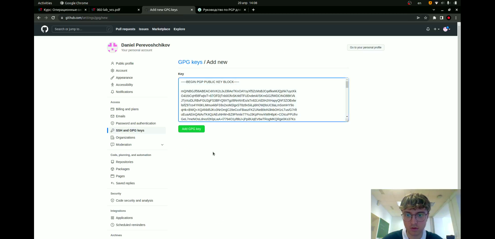

---
## Front matter
title: "Лабораторная работа №2"
subtitle: "Управление версиями"
author: "Перевощиков Данил Алексеевич"

## Generic otions
lang: ru-RU
toc-title: "Содержание"

## Bibliography
bibliography: bib/cite.bib
csl: pandoc/csl/gost-r-7-0-5-2008-numeric.csl

## Pdf output format
toc: true # Table of contents
toc-depth: 2
lof: true # List of figures
lot: true # List of tables
fontsize: 12pt
linestretch: 1.5
papersize: a4
documentclass: scrreprt
## I18n polyglossia
polyglossia-lang:
  name: russian
  options:
	- spelling=modern
	- babelshorthands=true
polyglossia-otherlangs:
  name: english
## I18n babel
babel-lang: russian
babel-otherlangs: english
## Fonts
mainfont: PT Serif
romanfont: PT Serif
sansfont: PT Sans
monofont: PT Mono
mainfontoptions: Ligatures=TeX
romanfontoptions: Ligatures=TeX
sansfontoptions: Ligatures=TeX,Scale=MatchLowercase
monofontoptions: Scale=MatchLowercase,Scale=0.9
## Biblatex
biblatex: true
biblio-style: "gost-numeric"
biblatexoptions:
  - parentracker=true
  - backend=biber
  - hyperref=auto
  - language=auto
  - autolang=other*
  - citestyle=gost-numeric
## Pandoc-crossref LaTeX customization
figureTitle: "Рис."
tableTitle: "Таблица"
listingTitle: "Листинг"
lofTitle: "Список иллюстраций"
lotTitle: "Список таблиц"
lolTitle: "Листинги"
## Misc options
indent: true
header-includes:
  - \usepackage{indentfirst}
  - \usepackage{float} # keep figures where there are in the text
  - \floatplacement{figure}{H} # keep figures where there are in the text
---

# Цель работы

Изучить идеологию и применение средства контроля версий.

# Ход работы

**1.**
До выполнения лабораторной работы у меня уже был аккаунт на https://github.com/(рис. [-@fig:001])

{ #fig:001 width=70% }

**2.**
Начинаем установку необходимого программного обеспечения.(рис. [-@fig:002])

{ #fig:002 width=70% }

**3.**
Выполняем базовую настройку git.(рис. [-@fig:003])

{ #fig:003 width=70% }

**4.**
Создание ключей ssg и pgp.(рис. [-@fig:004;-@fig:005;-@fig:006;-@fig:007])

{ #fig:004 width=70% }

{ #fig:005 width=70% }

{ #fig:006 width=70% }

{ #fig:007 width=70% }

При создании ключа pgp необходимо было выбрать опции и ответить на вопросы.(рис. [-@fig:008;-@fig:009])

{ #fig:008 width=70% }

{ #fig:009 width=70% }

**5.**
Добавление ключа pgp в github.(рис. [-@fig:010;-@fig:011])

{ #fig:010 width=70% }

{ #fig:011 width=70% }

**6.**
Завершение оставшихся настроек.(рис. [-@fig:012;-@fig:013;-@fig:014])

{ #fig:012 width=70% }

{ #fig:013 width=70% }

{ #fig:014 width=70% }

**7.**
Создание репозитория курса.(рис. [-@fig:015;-@fig:016;-@fig:017])

{ #fig:015 width=70% }

{ #fig:016 width=70% }

{ #fig:017 width=70% }

Удаляем лишние файлы, и создаем необходимые каталоги командой make COURSE=os-intro.(рис. [-@fig:018;-@fig:019])

{ #fig:018 width=70% }

{ #fig:019 width=70% }

# Вывод

Мы изучили идеологию и применение средства контроля версий.

# Контрольные вопросы

1. Что такое системы контроля версий (VCS) и для решения каких задач они предназначаются?
VCS — программной обеспечение для облегчения работы с изменяющейся информацией. Система управления версиями позволяет хранить несколько версий одного и того же документа, при необходимости возвращаться к более ранним версиям, определять, кто и когда сделал то или иное изменение, и многое другое.

2. Объясните следующие понятия VCS и их отношения: хранилище, commit, история, рабочая копия.
    - Репозиторий - хранилище версий — в нем хранятся все документы вместе с историей их изменений.
    - Commit — процесс создания новой версии.
    - Версия — состояние всех файлов на определенный момент времени.
    - Рабочая копия — текущее состояние файлов проекта, основанное на версии, загруженной из хранилища.

3. Что представляют собой и чем отличаются централизованные и децентрализованные VCS? Приведите примеры VCS каждого вида.
Централизованные VCS - клиент-серверная модель: один центральный репозиторий, с которым разработчики взаимодействуют по сети. Например Subversion (SVN).
Децентрализованные VCS - В отличие от централизованной модели, может существовать несколько экземпляров репозитория, которые время от времени синхронизируются между собой. 

4. Опишите действия с VCS при единоличной работе с хранилищем.
Создаем локальный репозиторий, добавляем файлы и пушим их.

5. Опишите порядок работы с общим хранилищем VCS.
Создаем репозиторий, редактируем файлы в локальном репозитории и пушим их на сервер при необходимости.

6. Каковы основные задачи, решаемые инструментальным средством git?
Две основные задачи: хранить информацию обо всех изменениях в коде и обеспечить удобства командной работы над кодом.

7. Назовите и дайте краткую характеристику командам git.
- создание основного дерева репозитория: git init
- получение обновлений (изменений) текущего дерева из центрального репозитория: git pull
- отправка всех произведённых изменений локального дерева в центральный репозиторий: git push
- просмотр списка изменённых файлов в текущей директории: git status
- просмотр текущих изменения: git diff
- добавить все изменённые и/или созданные файлы и/или каталоги: git add .
- добавить конкретные изменённые и/или созданные файлы и/или каталоги: git add имена_файлов
- удалить файл и/или каталог из индекса репозитория (при этом файл и/или каталог остаётся в локальной директории): git rm имена_файлов
- сохранить все добавленные изменения и все изменённые файлы: git commit -am 'Описание коммита'
- сохранить добавленные изменения с внесением комментария через встроенный редактор: git commit
- создание новой ветки, базирующейся на текущей: git checkout -b имя_ветки
- переключение на некоторую ветку: git checkout имя_ветки (при переключении на ветку, которой ещё нет в локальном репозитории, она будет создана и связана с удалённой)
- отправка изменений конкретной ветки в центральный репозиторий: git push origin имя_ветки
- слияние ветки с текущим деревом: git merge --no-ff имя_ветки
- удаление локальной уже слитой с основным деревом ветки: git branch -d имя_ветки – принудительное удаление локальной ветки: git branch -D имя_ветки
- удаление ветки с центрального репозитория: git push origin :имя_ветки

9. Что такое и зачем могут быть нужны ветви (branches)?
Ветка — это скользящий указатель на один из коммитов. Когда мы создаем новые коммиты, указатель ветки автоматически сдвигается вперед к вновь созданному коммиту. Ветки позволяют одновременно работать над разными версиями проекта.

10. Как и зачем можно игнорировать некоторые файлы при commit?
Во время работы над проектом так или иначе могут создаваться файлы, которые не требуется добавлять в последствии в репозиторий. Например, временные файлы, создаваемые редакторами, или объектные файлы, создаваемые компиляторами. Можно прописать шаблоны игнорируемых при добавлении в репозиторий типов файлов в файл .gitignore с помощью сервисов.