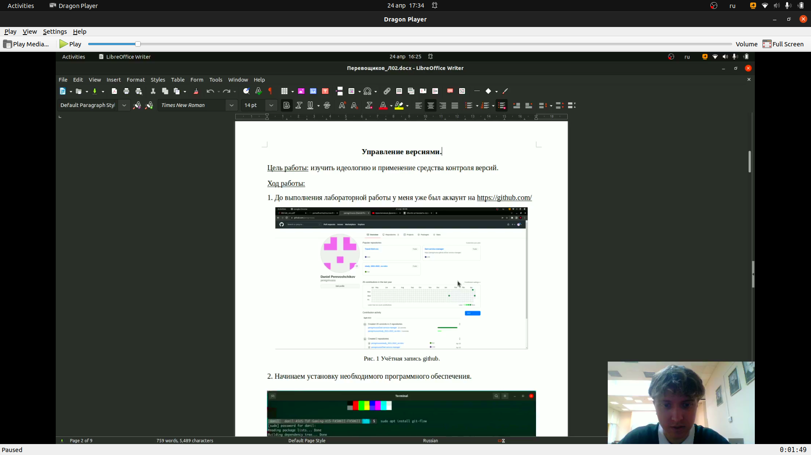
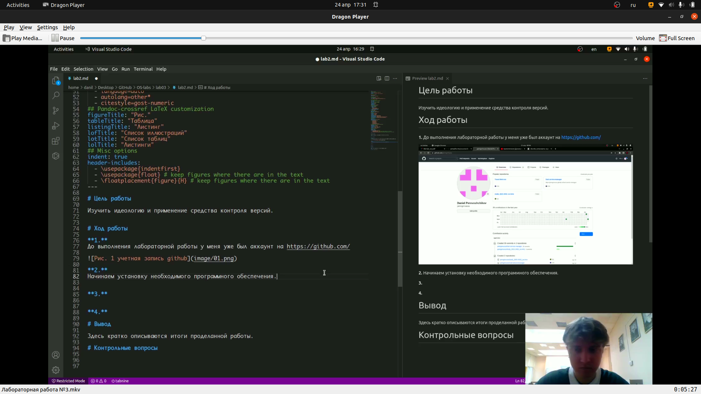
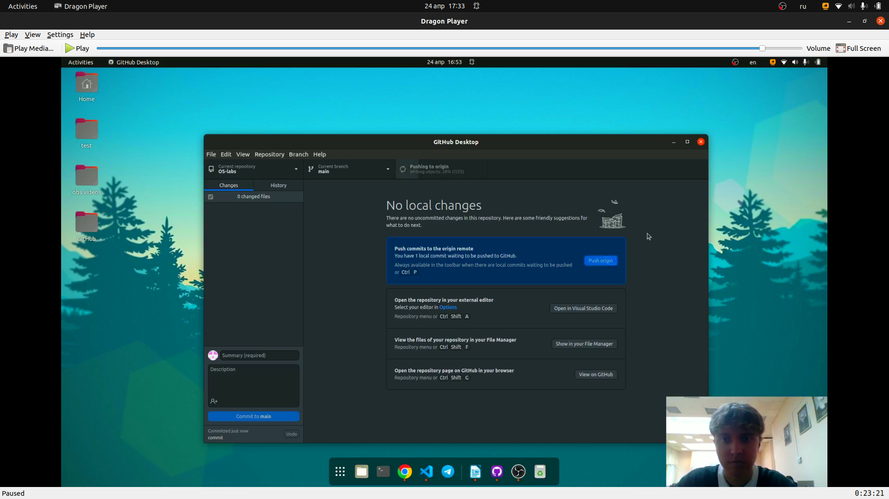

**Лабораторная работа №3**

**Markdown**

Перевощиков Данил Алексеевич

---

## Цель работы:

Научиться оформлять отчёты с помощью легковесного языка разметки Markdown.

## Задачи:

1. Сохранить все изображения из отчета в фомрате docs.
2. Изучить язык разметки markdown.
3. Переделать отчет в формате markdown.

---

## Что такое Markdown?

Эот облегчённый язык разметки, созданный с целью обозначения форматирования в простом тексте, с максимальным сохранением его читаемости человеком, и пригодный для машинного преобразования в языки для продвинутых публикаций.

---

## Базовые сведения о Markdown

Чтобы создать заголовок, используйте знак ( # ), например:

```
 # This is heading 1
 ## This is heading 2
 ### This is heading 3
 #### This is heading 4
```

Чтобы задать для текста полужирное начертание, заключите его в двойные звездочки:

``` This text is **bold** ```

Чтобы задать для текста курсивное начертание, заключите его в одинарные звездочки:

``` This text is *italic* ```

Блоки цитирования создаются с помощью символа >:

---

## Основные этапы выполнения работы

**1.** Открыли отчет, сделанный в формате docs и экспортировали все изображения в папку, которая находится рядом с проектом.(рис. [-@fig:001])

---

## Основные этапы выполнения работы

{ #fig:001 width=70% }

---

## Основные этапы выполнения работы

**2.** Используем шаблон отчета markdown и заполняем его в соответствии с отчетом в формате docs.(рис. [-@fig:002])

---

## Основные этапы выполнения работы

{ #fig:002 width=70% }

---

## Основные этапы выполнения работы

**3.** Сохраняем документ и загружаем на Github.(рис. [-@fig:003])

---

## Основные этапы выполнения работы

{ #fig:003 width=70% }

---

## Вывод:

Мы научились оформлять отчёты с помощью легковесного языка разметки Markdown.