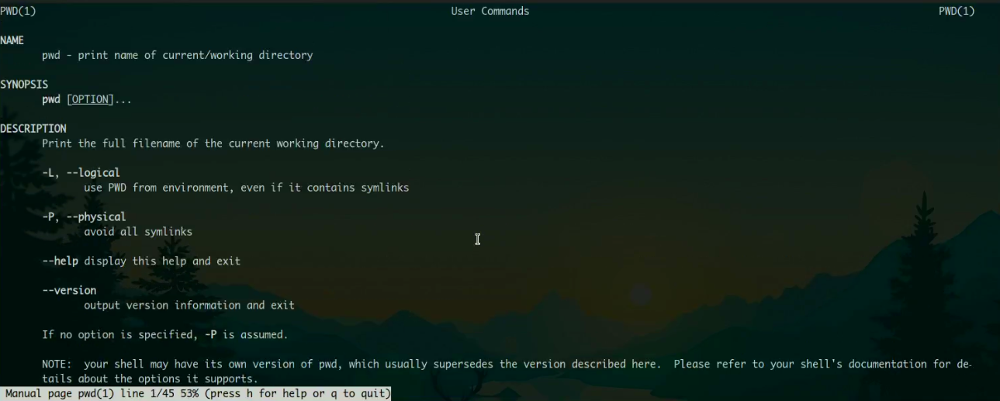

---
## Front matter
title: "Лабораторная работа №4"
subtitle: "Отчет"
author: "Перевощиков Данил Алексеевич"

## Generic otions
lang: ru-RU
toc-title: "Содержание"

## Bibliography
bibliography: bib/cite.bib
csl: pandoc/csl/gost-r-7-0-5-2008-numeric.csl

## Pdf output format
toc: true # Table of contents
toc-depth: 2
lof: true # List of figures
lot: true # List of tables
fontsize: 12pt
linestretch: 1.5
papersize: a4
documentclass: scrreprt
## I18n polyglossia
polyglossia-lang:
  name: russian
  options:
	- spelling=modern
	- babelshorthands=true
polyglossia-otherlangs:
  name: english
## I18n babel
babel-lang: russian
babel-otherlangs: english
## Fonts
mainfont: PT Serif
romanfont: PT Serif
sansfont: PT Sans
monofont: PT Mono
mainfontoptions: Ligatures=TeX
romanfontoptions: Ligatures=TeX
sansfontoptions: Ligatures=TeX,Scale=MatchLowercase
monofontoptions: Scale=MatchLowercase,Scale=0.9
## Biblatex
biblatex: true
biblio-style: "gost-numeric"
biblatexoptions:
  - parentracker=true
  - backend=biber
  - hyperref=auto
  - language=auto
  - autolang=other*
  - citestyle=gost-numeric
## Pandoc-crossref LaTeX customization
figureTitle: "Рис."
tableTitle: "Таблица"
listingTitle: "Листинг"
lofTitle: "Список иллюстраций"
lotTitle: "Список таблиц"
lolTitle: "Листинги"
## Misc options
indent: true
header-includes:
  - \usepackage{indentfirst}
  - \usepackage{float} # keep figures where there are in the text
  - \floatplacement{figure}{H} # keep figures where there are in the text
---

# Цель работы

Приобретение практических навыков взаимодействия пользователя с системой посредством командной строки.

# Ход работы

**1.** Определите полное имя вашего домашнего каталога. Далее относительно этого каталога будут выполняться последующие упражнения.(рис. [-@fig:001])

{ #fig:001 width=70% }

**2.** Выполните следующие действия:

**2.1.** Перейдите в каталог /tmp.(рис. [-@fig:002])

{ #fig:002 width=70% }

**2.2.** Выведите на экран содержимое каталога /tmp. Для этого используйте команду ls с различными опциями. Поясните разницу в выводимой на экран информации.(рис. [-@fig:003;-@fig:004])

{ #fig:003 width=70% }

{ #fig:004 width=70% }

**2.3.**  Определите, есть ли в каталоге /var/spool подкаталог с именем cron?(рис. [-@fig:005])

{ #fig:005 width=70% }

**2.34.**  Перейдите в Ваш домашний каталог и выведите на экран его содержимое. Определите, кто является владельцем файлов и подкаталогов?(рис. [-@fig:006])

{ #fig:006 width=70% }

**3.** Выполните следующие действия:

**3.1**  В домашнем каталоге создайте новый каталог с именем newdir.
**3.2** В каталоге ~/newdir создайте новый каталог с именем morefun.(рис. [-@fig:007])

{ #fig:007 width=70% }

**3.3** В домашнем каталоге создайте одной командой три новых каталога с именами letters, memos, misk. Затем удалите эти каталоги одной командой.(рис. [-@fig:008])

{ #fig:008 width=70% }

**3.4** Попробуйте удалить ранее созданный каталог ~/newdir командой rm. Проверьте, был ли каталог удалён.(рис. [-@fig:009])

{ #fig:009 width=70% }

**3.5** Удалите каталог ~/newdir/morefun из домашнего каталога. Проверьте, был ли каталог удалён.(рис. [-@fig:010])

{ #fig:010 width=70% }

**4.** С помощью команды man определите, какую опцию команды ls нужно использовать для просмотра содержимое не только указанного каталога, но и подкаталогов, входящих в него.(рис. [-@fig:011])

{ #fig:011 width=70% }

**5.** С помощью команды man определите набор опций команды ls, позволяющий отсортировать по времени последнего изменения выводимый список содержимого каталога с развёрнутым описанием файлов.(рис. [-@fig:012])

{ #fig:012 width=70% }

**6.** Используйте команду man для просмотра описания следующих команд: cd, pwd, mkdir, rmdir, rm. Поясните основные опции этих команд.(рис. [-@fig:013;-@fig:014;-@fig:015;-@fig:016;-@fig:017;-@fig:018])

{ #fig:013 width=70% }

{ #fig:014 width=70% }

{ #fig:015 width=70% }

{ #fig:016 width=70% }

{ #fig:017 width=70% }

{ #fig:018 width=70% }

**7.** Используя информацию, полученную при помощи команды history, выполните модификацию и исполнение нескольких команд из буфера команд.(рис. [-@fig:019])

{ #fig:019 width=70% }

# Вывод

Мы приобрели практические навыкы взаимодействия пользователя с системой посредством командной строки.

# Контрольные вопросы

**1.** *Что такое командная строка?*

Это специальная программа, которая позволяет управлять компьютером путем ввода текстовых команд с клавиатуры.

**2.** *При помощи какой команды можно определить абсолютный путь текущего каталога? Приведите пример.*

При помощи команды realpath. Например если ввести realpath timeout, то выведется /home/mial/bin/timeout.

**3.** *При помощи какой команды и каких опций можно определить только тип файлов и их имена в текущем каталоге? Приведите примеры.*

Только тип файлов и их имена в текущем каталоге можно определить с помощью команды ls -F.

**4.** *Каким образом отобразить информацию о скрытых файлах? Приведите примеры.*

Отобразить информацию о скрытых файлах можно с помощью команды ls -a.

**5.** *При помощи каких команд можно удалить файл и каталог? Можно ли это сделать одной и той же командой? Приведите примеры.*

Удалить файл и каталог можно с помощью команд rm и rmdir. Это нельзя сделать одной и той же командой, так как rmdir используется чтобы удалять пустые файлы, а rm используется чтобы удалить не пустые файлы.

**6.** *Каким образом можно вывести информацию о последних выполненных пользователем командах?*

При помощи команды history.

**7.** *Как воспользоваться историей команд для их модифицированного выполнения? Приведите примеры.*

Это можно сделать с помощью следующей команды: !<номер_команды>:s/<что_меняем>/<на_что_меняем>. Например: history ls -F !282:s/F/a.

**8.** *Приведите примеры запуска нескольких команд в одной строке.*

Например: mkdir newdir; cd newdir; ls.

**9.** *Дайте определение и приведите примера символов экранирования.*

Экранирование - это замена в тексте управляющих символов на соответствующие текстовые подстановки. Один из видов управляющих последовательностей. Пример символа : "".

**10.** *Охарактеризуйте вывод информации на экран после выполнения команды ls с опцией l.*

После выполнения команды ls с опцией l выводится подробный список файлов, в котором отображается владелец, группа, дата создания размер и т.д.

**11.** *Что такое относительный путь к файлу? Приведите примеры использования относительного и абсолютного пути при выполнении какой-либо команды.*

Относительный путь к файлу - это путь к файлу относительно текущей папки. При импользовании команды pwd на экран выведется относительный путь текущей директории, а при команде realpath на экран выведется абсолютный путь текущей директории.

**12.** *Как получить информацию об интересующей вас команде?*

С помощью команды man.

**13.** *Какая клавиша или комбинация клавиш служит для автоматического дополнения вводимых команд?*

Клавиша tab cлужит для автоматического дополнения вводимых команд.