---
## Front matter
title: "Лабораторная работа №5"
subtitle: "Анализ файловой системы Linux. Команды для работы с файлами и каталогами"
author: "Перевощиков Данил Алексеевич"

## Generic otions
lang: ru-RU
toc-title: "Содержание"

## Bibliography
bibliography: bib/cite.bib
csl: pandoc/csl/gost-r-7-0-5-2008-numeric.csl

## Pdf output format
toc: true # Table of contents
toc-depth: 2
lof: true # List of figures
lot: true # List of tables
fontsize: 12pt
linestretch: 1.5
papersize: a4
documentclass: scrreprt
## I18n polyglossia
polyglossia-lang:
  name: russian
  options:
	- spelling=modern
	- babelshorthands=true
polyglossia-otherlangs:
  name: english
## I18n babel
babel-lang: russian
babel-otherlangs: english
## Fonts
mainfont: PT Serif
romanfont: PT Serif
sansfont: PT Sans
monofont: PT Mono
mainfontoptions: Ligatures=TeX
romanfontoptions: Ligatures=TeX
sansfontoptions: Ligatures=TeX,Scale=MatchLowercase
monofontoptions: Scale=MatchLowercase,Scale=0.9
## Biblatex
biblatex: true
biblio-style: "gost-numeric"
biblatexoptions:
  - parentracker=true
  - backend=biber
  - hyperref=auto
  - language=auto
  - autolang=other*
  - citestyle=gost-numeric
## Pandoc-crossref LaTeX customization
figureTitle: "Рис."
tableTitle: "Таблица"
listingTitle: "Листинг"
lofTitle: "Список иллюстраций"
lotTitle: "Список таблиц"
lolTitle: "Листинги"
## Misc options
indent: true
header-includes:
  - \usepackage{indentfirst}
  - \usepackage{float} # keep figures where there are in the text
  - \floatplacement{figure}{H} # keep figures where there are in the text
---

# Цель работы

Ознакомление с файловой системой Linux, её структурой, именами и содержанием каталогов. Приобретение практических навыков по применению команд для работы с файлами и каталогами, по управлению процессами (и работами), по проверке использования диска и обслуживанию файловой системы.

# Ход работы

**1.** Выполняем все примеры, приведённые в первой части описания лабораторной работы.(рис. [-@fig:001;-@fig:002;-@fig:003;-@fig:004;-@fig:005])

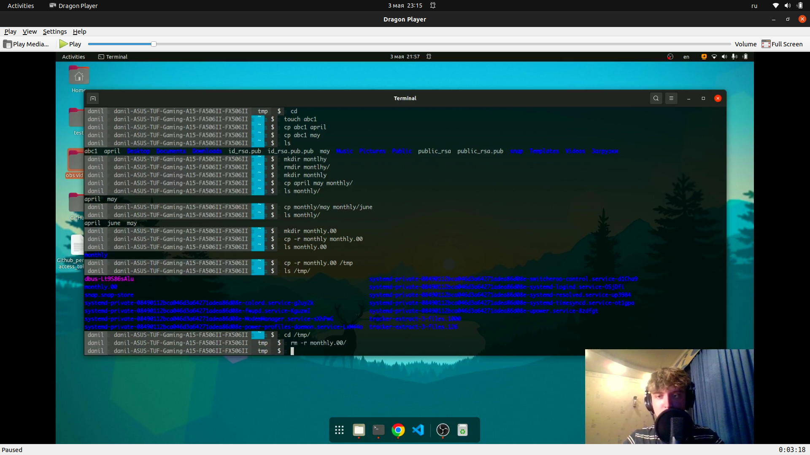{ #fig:001 width=70% }

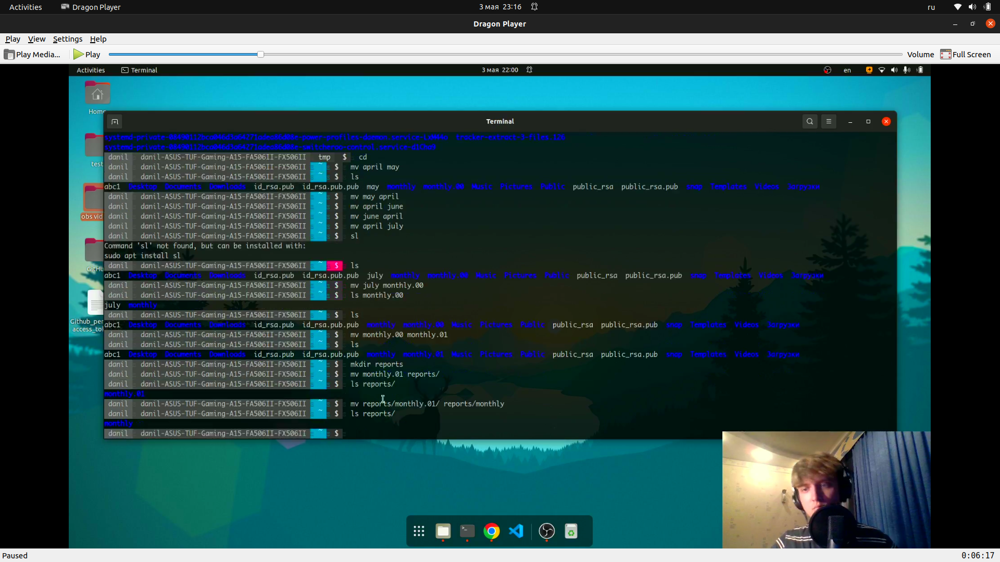{ #fig:002 width=70% }

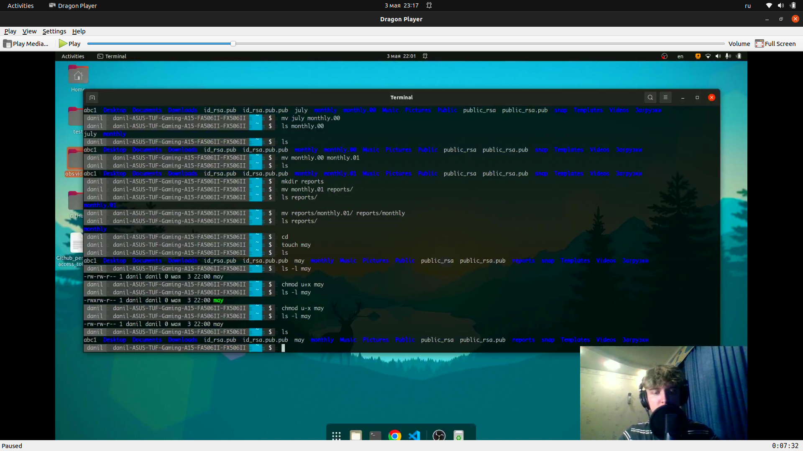{ #fig:003 width=70% }

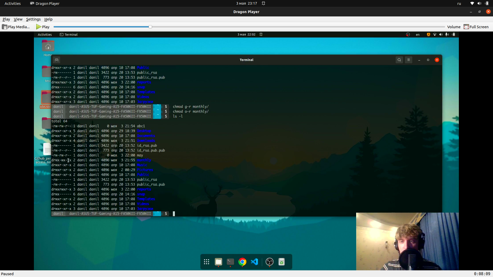{ #fig:004 width=70% }

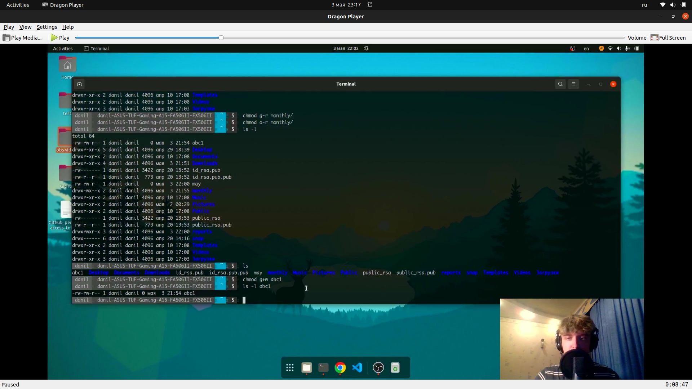{ #fig:005 width=70% }

**2.1** Скопируем файл /usr/include/sys/io.h в домашний каталог и называем его equipment. Папки sys нет, поэтому берем файл error.h из /usr/include/ c помощью команды *cp error.h /home/danil/equipment*(рис. [-@fig:006])

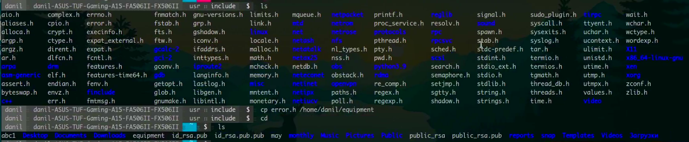{ #fig:006 width=70% }

**2.2** В домашнем каталоге создаем директорию /ski.plases с помощью команды *mkdir*. Перемещаем файл equipment в каталог /ski.plases с помощью команды *mv equipment ski.plases/*. Переименовываем  файл /ski.plases/equipment в ~/ski.plases/equiplist с помощью команды *mv ski.plases/equipment ski.plases/equiplist*. Создаем в домашнем каталоге файл abc1 (он уже был создан) и копируем его в каталог /ski.plases под именем equiplist2. Создаем каталог с именем equipment в каталоге /ski.plases.(рис. [-@fig:007])

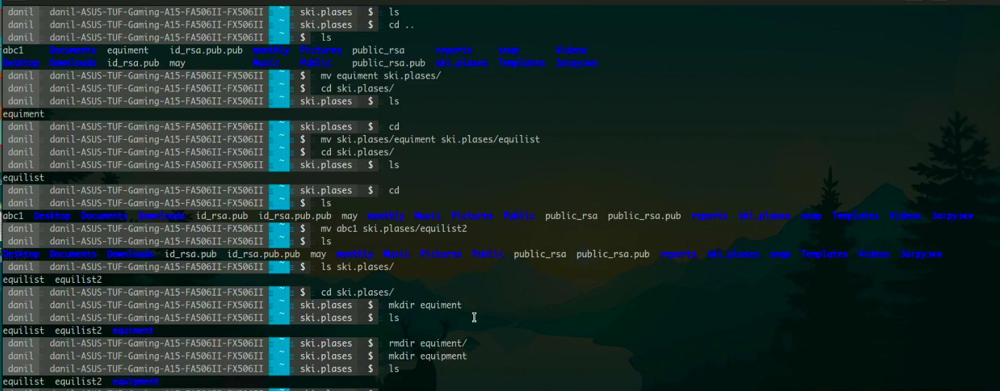{ #fig:007 width=70% }

**2.3** Перемещаем файлы /ski.plases/equiplist и equiplist2 в каталог /ski.plases/equipment. Создаем и перемещаем каталог /newdir в каталог /ski.plases и называем его plans.(рис. [-@fig:008])

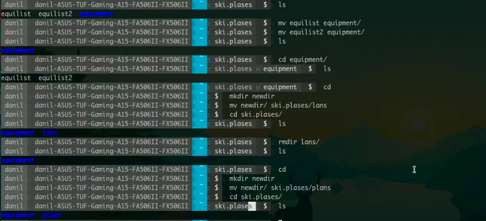{ #fig:008 width=70% }

**3.** Задаём необходимые права доступа для каталогов australia и play и файлов my_os и feathers.(рис. [-@fig:009;-@fig:010;-@fig:011;-@fig:012])

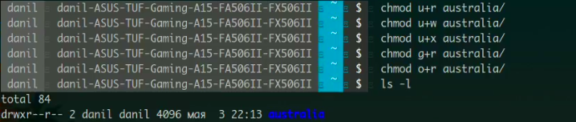{ #fig:009 width=70% }

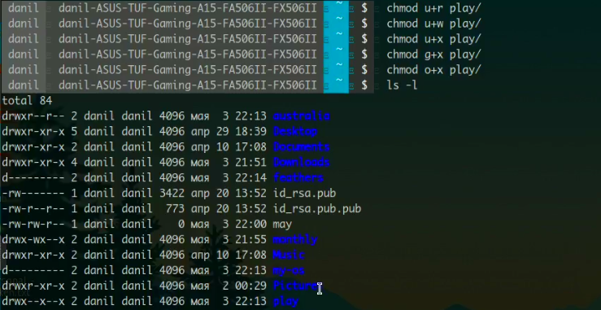{ #fig:010 width=70% }

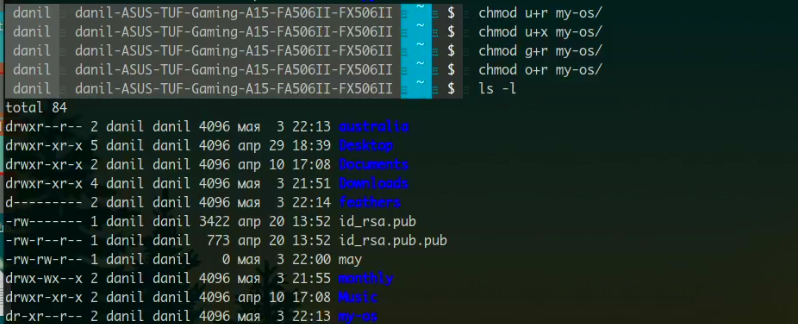{ #fig:011 width=70% }

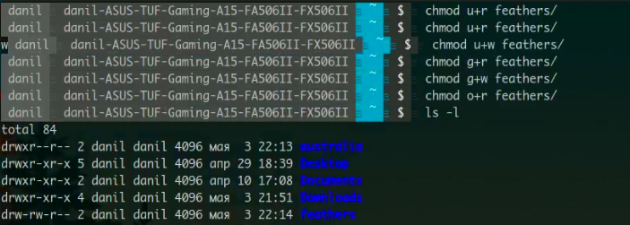{ #fig:012 width=70% }

**4.1** Просмотриваем содержимое файла /etc/password с помощью команды *cat*.(рис. [-@fig:013])

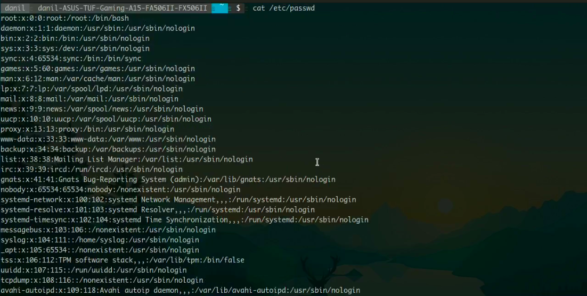{ #fig:013 width=70% }

**4.2** Копируем файл /feathers в файл /file.old с помощью команды *cp feathers file.old*. Перемещаем файл /file.old в каталог /play с помощью команды *mv file.old play/*. Копируем каталог /play в каталог /fun с помощью команды *cp -r play fun*. Перемещаем каталог /fun в каталог /play и называем его games с помощью команды *mv fun/play/games*.(рис. [-@fig:014])

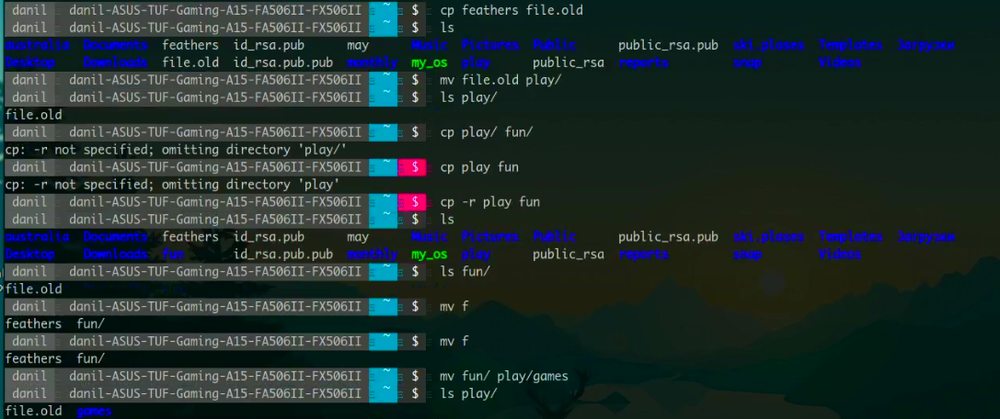{ #fig:014 width=70% }

**4.3** Лишаем владельца файла /feathers права на чтение с помощью команды *chmod u-r feathers/*. При попытке просмотра файла /feathers командой *cat* нам октазывают в доступе. ри попытке скопировать файл /feathers командой *cp* нам также октазывают в доступе.(рис. [-@fig:015])

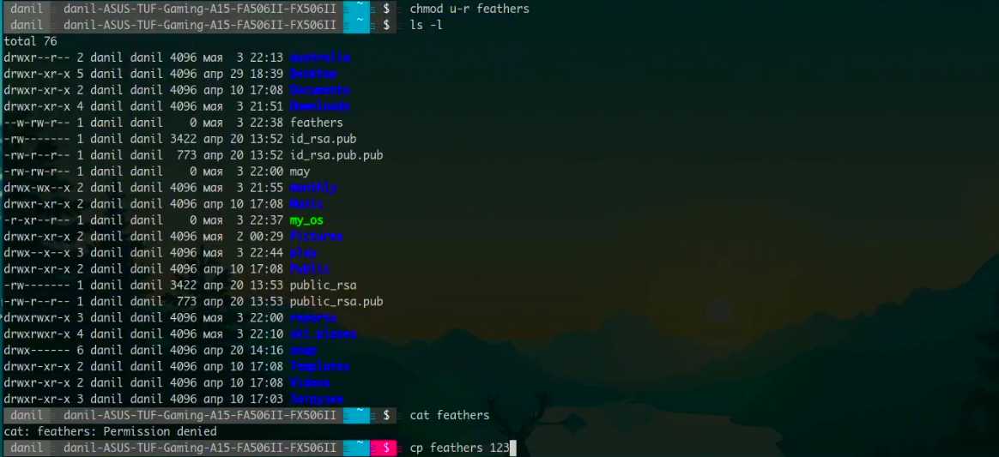{ #fig:015 width=70% }

**4.4** Лишаем владельца каталога /play права на выполнение с помощью команды *chmod u-x play/*. При попытке перехода в этот каталог нам отказывают в доступе.(рис. [-@fig:016]

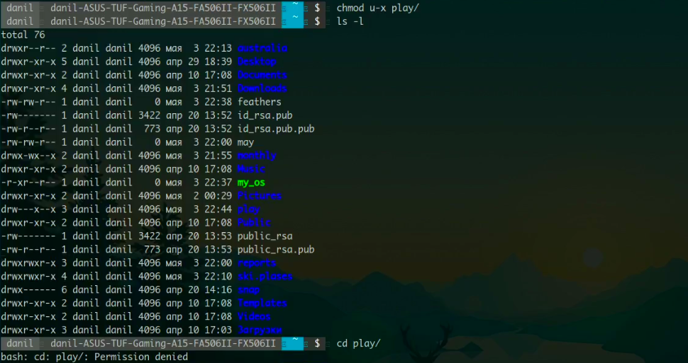{ #fig:016 width=70% }

**5.** Прочитаем man по командам mount, fsck, mkfs, kill и кратко их охарактеризуем, приведя примеры.(рис. [-@fig:017]

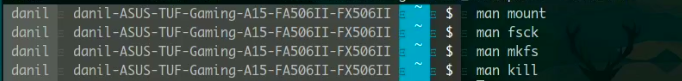{ #fig:017 width=70% }

```mount``` - утилита командной строки в UNIX-подобных операционных системах. Применяется для монтирования файловых систем. *mount /dev/cdrom /mnt/cdrom*

```fsck``` - это утилита командной строки, которая позволяет выполнять проверки согласованности и интерактивное исправление в одной или нескольких файловых системах Linux. Он использует программы, специфичные для типа файловой системы, которую он проверяет. *sudo fsck -p /dev/sda1*

```mkfs``` - используется для создания файловой системы Linux на некотором устройстве, обычно в разделе жёсткого диска. *sudo mkfs.ext4 /dev/sdb1*

```kill``` - является встроенной командой командной оболочки, предназначенной для отправки системных сигналов определенным процессам. Команда принимает числовые идентификаторы процессов, а также числовые или текстовые идентификаторы сигналов. *kill -9 3121*

# Вывод

Мы ознакомились с файловой системой Linux, её структурой, именами и содержанием каталогов. Приобрели практических навыков по применению команд для работы с файлами и каталогами, по управлению процессами (и работами), по проверке использования диска и обслуживанию файловой системы.

# Контрольные вопросы

1. *Дайте характеристику каждой файловой системе, существующей на жёстком диске компьютера, на котором вы выполняли лабораторную работу.*

FAT 16. Файловая система FAT (File Allocation Table) работает с единицами дискового пространства, называемыми кластерами, включающими один или несколько секторов жесткого диска. Минимальный размер кластера - 512 байт, а максимальный - 32 Кбайта. Таблица FAT идентифицирует записи, соответствующие дисковым кластерам, при помощи 16-разрядных чисел, т. е. в таблице можно разместить не более 65 536 записей (216). Не сложно подсчитать, что при максимальном размере кластера в 32 Кбайта максимальный раздел дискового тома будет составлять 2 Гбайта.

Ext4 — это результат эволюции Ext3, наиболее популярной файловой системы в Linux. Во многих аспектах Ext4 представляет собой больший шаг вперёд по сравнению с Ext3, чем Ext3 была по отношению к Ext2. Наиболее значительным усовершенствованием Ext3 по сравнению с Ext2 было журналирование, в то время как Ext4 предполагает изменения в важных структурах данных, таких как, например, предназначенных для хранения данных файлов.

2. *Приведите общую структуру файловой системы и дайте характеристику каждой директории первого уровня этой структуры.*

Файловая система Ext4 разделена на несколько групп блоков. Чтобы уменьшить узкое место производительности, вызванное фрагментацией диска, распределитель блоков пытается сохранить блоки данных каждого файла в одной и той же группе блоков, тем самым сокращая время поиска. Если взять в качестве примера блок данных размером 4 КБ, группа блоков может содержать 32768 блоков данных, то есть 128 МБ.

/ — root каталог. Содержит в себе всю иерархию системы;

/bin — здесь находятся двоичные исполняемые файлы. Основные общие команды, хранящиеся отдельно от других программ в системе (прим.: pwd, ls, cat, ps);

/boot — тут расположены файлы, используемые для загрузки системы (образ initrd, ядро vmlinuz);

/dev — в данной директории располагаются файлы устройств (драйверов). С помощью этих файлов можно взаимодействовать с устройствами. К примеру, если это жесткий диск, можно подключить его к файловой системе. В файл принтера же можно написать напрямую и отправить задание на печать;

/etc — в этой директории находятся файлы конфигураций программ. Эти файлы позволяют настраивать системы, сервисы, скрипты системных демонов;

/home — каталог, аналогичный каталогу Users в Windows. Содержит домашние каталоги учетных записей пользователей (кроме root). При создании нового пользователя здесь создается одноименный каталог с аналогичным именем и хранит личные файлы этого пользователя;

/lib — содержит системные библиотеки, с которыми работают программы и модули ядра;

/lost+found — содержит файлы, восстановленные после сбоя работы системы. Система проведет проверку после сбоя и найденные файлы можно будет посмотреть в данном каталоге;

/media — точка монтирования внешних носителей. Например, когда вы вставляете диск в дисковод, он будет автоматически смонтирован в директорию /media/cdrom;

/mnt — точка временного монтирования. Файловые системы подключаемых устройств обычно монтируются в этот каталог для временного использования;

/opt — тут расположены дополнительные (необязательные) приложения. Такие программы обычно не подчиняются принятой иерархии и хранят свои файлы в одном подкаталоге (бинарные, библиотеки, конфигурации);

/proc — содержит файлы, хранящие информацию о запущенных процессах и о состоянии ядра ОС;

/root — директория, которая содержит файлы и личные настройки суперпользователя;

/run — содержит файлы состояния приложений. Например, PID-файлы или UNIX-сокеты;

/sbin — аналогично /bin содержит бинарные файлы. Утилиты нужны для настройки и администрирования системы суперпользователем;

/srv — содержит файлы сервисов, предоставляемых сервером (прим. FTP или Apache HTTP);

/sys — содержит данные непосредственно о системе. Тут можно узнать информацию о ядре, драйверах и устройствах;

/tmp — содержит временные файлы. Данные файлы доступны всем пользователям на чтение и запись. Стоит отметить, что данный каталог очищается при перезагрузке;

/usr — содержит пользовательские приложения и утилиты второго уровня, используемые пользователями, а не системой. Содержимое доступно только для чтения (кроме root). Каталог имеет вторичную иерархию и похож на корневой;

/var — содержит переменные файлы. Имеет подкаталоги, отвечающие за отдельные переменные. Например, логи будут храниться в /var/log, кэш в /var/cache, очереди заданий в /var/spool/ и так далее.

3. *Какая операция должна быть выполнена, чтобы содержимое некоторой файловой системы было доступно операционной системе?*

Монтирование тома.

4. *Назовите основные причины нарушения целостности файловой системы. Как устранить повреждения файловой системы?*

Отсутствие синхронизации между образом файловой системы в памяти и ее данными на диске в случае аварийного останова может привести к появлению следующих ошибок:

- Один блок адресуется несколькими mode (принадлежит нескольким файлам).

- Блок помечен как свободный, но в то же время занят (на него ссылается onode).

- Блок помечен как занятый, но в то же время свободен (ни один inode на него не ссылается).

- Неправильное число ссылок в inode (недостаток или избыток ссылающихся записей в каталогах).

- Несовпадение между размером файла и суммарным размером адресуемых inode блоков.

- Недопустимые адресуемые блоки (например, расположенные за пределами файловой системы).

- "Потерянные" файлы (правильные inode, на которые не ссылаются записи каталогов).

- Недопустимые или неразмещенные номера inode в записях каталогов.

5. *Как создаётся файловая система?*

mkfs - позволяет создать файловую систему Linux.

6. *Дайте характеристику командам для просмотра текстовых файлов.*

Cat - выводит содержимое файла на стандартное устройство вывода

7. *Приведите основные возможности команды cp в Linux.*

cp - Копирует файлы и директории из одного места в другое.
Она может:
- Скопировать несколько файлов
- Скопировать файл с подтверждением
- Показать информацию о копируемых файлах
- Скопировать директорию
- Скопировать только если файлы новее
- Не перезаписывать существующие файлы
- Скопировать только атрибуты
- Создать резервную копию для результирующих файлов, если они существуют
- Принудительно перезаписывать существующие файлы назначения

8. *Приведите основные возможности команды mv в Linux*

mv - Переместить (или переименовать) файлы или директории.
Она может:
- Переместить файл
- Переименовать файл
- Переименовать директорию
- Создавать резервные копии существующих файлов

9. *Что такое права доступа? Как они могут быть изменены?*

Права доступа — совокупность правил, регламентирующих порядок и условия доступа субъекта к объектам информационной системы установленных правовыми документами или собственником, владельцем информации.
Права доступа к файлу или каталогу можно изменить, воспользовавшись командой chmod. Сделать это может владелец файла (или каталога) или пользователь с правами администратора.