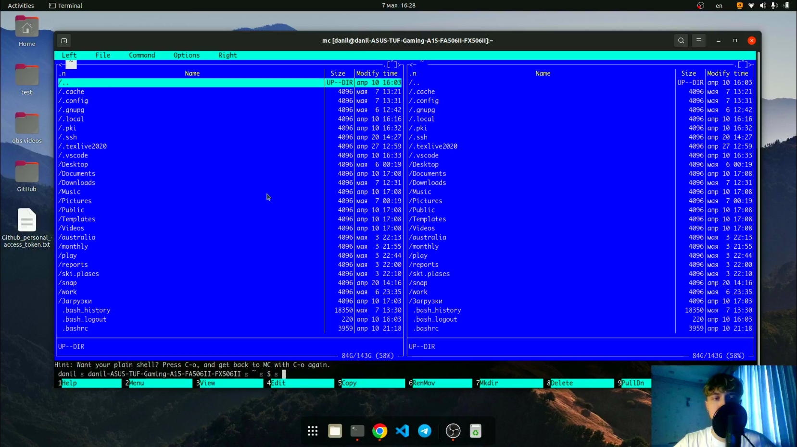

# Командная оболочка Midnight Commander

---

## Цель работы:

Освоение основных возможностей командной оболочки Midnight Commander. Приобретение навыков практической работы по просмотру каталогов и файлов; манипуляций
с ними.

---

## Основные этапы выполнения работы

**1.** Вызвали man mc и изучили данную команду, запустили mc из командной строки и изучили его структуру и меню.

{ #fig:002 width=70% }

---

## Основные этапы выполнения работы

**2.** Выполнили несколько команд, а именно скопировали file.txt в каталог Downloads и создали каталог test.

**3.** Далее мы изучили возможности меню File на практике.

**3.** Далее мы изучили возможности меню Command на практике.

---

## Основные этапы выполнения работы

**5.** Вызвали подменю Settings и освоили операции, определяющие структуру экрана mc
(Full screen, Double Width, Show Hidden Files и т.д.).

**6.** Создали текстовой файл text.txt, открыли этот файл с помощью встроенного в mc редактора и вставили туда текст определения Информатики.

**7.** Изучили горячие клавиши текстового редактора на практике.

---

## Основные этапы выполнения работы

**8.** Открыли файл с исходным текстом на языке программирования Python и, используя меню редактора, выключили подсветку синтаксиса.

**9.** Ответили на контрольные вопросы.

---

## Вывод:

Мы освоили основные возможности командной оболочки Midnight Commander. Приобретели навыки практической работы по просмотру каталогов и файлов; манипуляций
с ними.