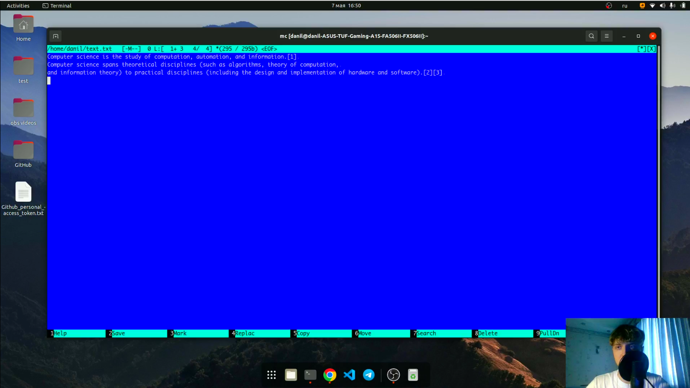
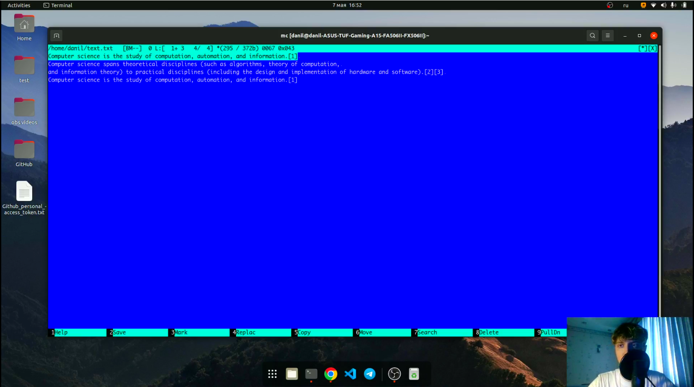

---
## Front matter
title: "Лабораторная работа №7"
subtitle: "Командная оболочка Midnight Commander"
author: "Перевощиков Данил Алексеевич"

## Generic otions
lang: ru-RU
toc-title: "Содержание"

## Bibliography
bibliography: bib/cite.bib
csl: pandoc/csl/gost-r-7-0-5-2008-numeric.csl

## Pdf output format
toc: true # Table of contents
toc-depth: 2
lof: true # List of figures
lot: true # List of tables
fontsize: 12pt
linestretch: 1.5
papersize: a4
documentclass: scrreprt
## I18n polyglossia
polyglossia-lang:
  name: russian
  options:
	- spelling=modern
	- babelshorthands=true
polyglossia-otherlangs:
  name: english
## I18n babel
babel-lang: russian
babel-otherlangs: english
## Fonts
mainfont: PT Serif
romanfont: PT Serif
sansfont: PT Sans
monofont: PT Mono
mainfontoptions: Ligatures=TeX
romanfontoptions: Ligatures=TeX
sansfontoptions: Ligatures=TeX,Scale=MatchLowercase
monofontoptions: Scale=MatchLowercase,Scale=0.9
## Biblatex
biblatex: true
biblio-style: "gost-numeric"
biblatexoptions:
  - parentracker=true
  - backend=biber
  - hyperref=auto
  - language=auto
  - autolang=other*
  - citestyle=gost-numeric
## Pandoc-crossref LaTeX customization
figureTitle: "Рис."
tableTitle: "Таблица"
listingTitle: "Листинг"
lofTitle: "Список иллюстраций"
lotTitle: "Список таблиц"
lolTitle: "Листинги"
## Misc options
indent: true
header-includes:
  - \usepackage{indentfirst}
  - \usepackage{float} # keep figures where there are in the text
  - \floatplacement{figure}{H} # keep figures where there are in the text
---

# Цель работы

Освоение основных возможностей командной оболочки Midnight Commander. Приобретение навыков практической работы по просмотру каталогов и файлов; манипуляций
с ними.

# Ход работы

**1.** Вызвали man mc и изучили данную команду.(рис. [-@fig:001])

{ #fig:001 width=70% }

Запустили из командной строки mc и изучили его структуру и меню.(рис. [-@fig:002])

{ #fig:002 width=70% }

**2.** Выполнили несколько команд, а именно скопировали file.txt в каталог Downloads (рис. [-@fig:003]) и создали каталог test (рис. [-@fig:004]).

{ #fig:003 width=70% }

{ #fig:004 width=70% }


**3.** Далее мы использовали возможности меню File, чтобы:

**3.1** Просмотреть содержимое текстового файла conf.txt.(рис. [-@fig:005])

{ #fig:005 width=70% }

**3.2** Редактировать содержимое текстового файла conf.txt без сохранения результатов
редактирования. (рис. [-@fig:006])

{ #fig:006 width=70% }

**3.3** Копировать некоторые файлы в созданный каталог test.(рис. [-@fig:007])

{ #fig:007 width=70% }

**4.** Далее мы использовали возможности меню Command, чтобы:

**4.1** Осуществить поиск в файловой системе файла с заданными условиями (например, файла с расширением .c или .cpp, содержащего строку main), как можно увидеть, таких файлов мы не нашли.(рис. [-@fig:008])

{ #fig:008 width=70% }

**4.2** Посмотреть прошлую выполненную команду.(рис. [-@fig:009])

{ #fig:009 width=70% }

**4.3** Перейти в домашний каталог.(рис. [-@fig:010])

{ #fig:010 width=70% }

**4.4** Анализировать файл меню и файл расширений.(рис. [-@fig:011;-@fig:012])

{ #fig:011 width=70% }

{ #fig:012 width=70% }

**5.** Вызвали подменю Settings и освоили операции, определяющие структуру экрана mc
(Full screen, Double Width, Show Hidden Files и т.д.).(рис. [-@fig:013])

{ #fig:013 width=70% }

**6.** Создали текстовой файл text.txt, открыли этот файл с помощью встроенного в mc редактора и вставили туда текст определения Информатики с помощью *Ctrl+Insert*.(рис. [-@fig:014])

{ #fig:014 width=70% }

**7.** Проделали с текстом следующие манипуляции, используя горячие клавиши:

**7.1** Удалили строку текста *Ctrl+y*.(рис. [-@fig:015])

{ #fig:015 width=70% }

**7.2** Выделили фрагмент текста *F3* и скопировали его на новую строку *F5*.(рис. [-@fig:016])

{ #fig:016 width=70% }

**7.3** Выделили фрагмент текста *F3* и перенесли его на новую строку *F6*.(рис. [-@fig:017])

{ #fig:017 width=70% }

**7.4** Сохранили файл *F2* и отменили последнее действие *Ctrl+u*.(рис. [-@fig:018])

{ #fig:018 width=70% }

**7.5** Перешли в конец файла (нажав *Ctrl+Home*) и написали некоторый
текст, а также перешли в начало файла (нажав *Ctrl+End*) и написали некоторый
текст.(рис. [-@fig:019])

{ #fig:019 width=70% }

**7.6** Сохранили и закрыли файл *F10*.(рис. [-@fig:020])

{ #fig:020 width=70% }

**8.** Открыли файл с исходным текстом на языке программирования Python (рис. [-@fig:021]) и, используя меню редактора, выключили подсветку синтаксиса.(рис. [-@fig:022])

{ #fig:021 width=70% }

{ #fig:022 width=70% }

# Вывод

Мы освоили основные возможности командной оболочки Midnight Commander. Приобретели навыки практической работы по просмотру каталогов и файлов; манипуляций
с ними.

# Контрольные вопросы

1. *Какие режимы работы есть в mc. Охарактеризуйте их.*

Панели могут дополнительно быть переведены в один из двух режимов: ```Информация``` или ```Дерево```. В режиме Информация на панель выводятся сведения о файле и текущей файловой системе, расположенных на активной панели. В режиме Дерево на одной из панелей выводится структура дерева каталогов.

2. *Какие операции с файлами можно выполнить как с помощью команд shell, так и с помощью меню (комбинаций клавиш) mc? Приведите несколько примеров.*

Например, создать каталог и редактировать файл.

3. *Опишите структуру меню левой (или правой) панели mc, дайте характеристику командам.*

Перейти в строку меню панелей mc можно с помощью функциональной клавиши F9.
В строке меню имеются пять меню: ```Левая панель``` , ```Файл``` , ```Команда``` , ```Настройки``` и ```Правая панель```.

Подпункт меню ```Быстрый просмотр``` позволяет выполнить быстрый просмотр содержимого
панели.

Подпункт меню ```Информация``` позволяет посмотреть информацию о файле или каталоге.

В меню каждой (левой или правой) панели можно выбрать Формат списка :
- стандартный — выводит список файлов и каталогов с указанием размера и времени
правки;
- ускоренный — позволяет задать число столбцов, на которые разбивается панель при
выводе списка имён файлов или каталогов без дополнительной информации;
- расширенный — помимо названия файла или каталога выводит сведения о правах
доступа, владельце, группе, размере, времени правки;
- определённый пользователем — позволяет вывести те сведения о файле или каталоге,
которые задаст сам пользователь.

Подпункт меню ```Порядок сортировки``` позволяет задать критерии сортировки при выводе списка файлов и каталогов: без сортировки, по имени, расширенный, время правки, время доступа, время изменения атрибута, размер, узел.

4. *Опишите структуру меню Файл mc, дайте характеристику командам.*

Команды меню Файл :
- Просмотр ( F3 ) — позволяет посмотреть содержимое текущего (или выделенного)
файла без возможности редактирования.
- Просмотр вывода команды ( М + ! ) — функция запроса команды с параметрами
(аргумент к текущему выбранному файлу).
- Правка ( F4 ) — открывает текущий (или выделенный) файл для его редактирования.
- Копирование ( F5 ) — осуществляет копирование одного или нескольких файлов или
каталогов в указанное пользователем во всплывающем окне место.
- Права доступа ( Ctrl-x c ) — позволяет указать (изменить) права доступа к одному
или нескольким файлам или каталогам.
- Жёсткая ссылка ( Ctrl-x l ) — позволяет создать жёсткую ссылку к текущему (или
выделенному) файлу1.
- Символическая ссылка ( Ctrl-x s ) — позволяет создать символическую ссылку к текущему (или выделенному) файлу2.
- Владелец/группа ( Ctrl-x o ) — позволяет задать (изменить) владельца и имя группы
для одного или нескольких файлов или каталогов.
- Права (расширенные) — позволяет изменить права доступа и владения для одного
или нескольких файлов или каталогов.
- Переименование ( F6 ) — позволяет переименовать (или переместить) один или
несколько файлов или каталогов.
- Создание каталога ( F7 ) — позволяет создать каталог.
- Удалить ( F8 ) — позволяет удалить один или несколько файлов или каталогов.
- Выход ( F10 ) — завершает работу mc.

5. *Опишите структуру меню Команда mc, дайте характеристику командам.*

Команды меню Команда :
- Дерево каталогов — отображает структуру каталогов системы.
- Поиск файла — выполняет поиск файлов по заданным параметрам.
- Переставить панели — меняет местами левую и правую панели.
- Сравнить каталоги ( Ctrl-x d ) — сравнивает содержимое двух каталогов.
- Размеры каталогов — отображает размер и время изменения каталога (по умолчанию
в mc размер каталога корректно не отображается).
- История командной строки — выводит на экран список ранее выполненных в оболочке
команд.
- Каталоги быстрого доступа ( Ctrl-\ ) — пр вызове выполняется быстрая смена текущего
каталога на один из заданного списка.
- Восстановление файлов — позволяет восстановить файлы на файловых системах ext2
и ext3.
- Редактировать файл расширений — позволяет задать с помощью определённого синтаксиса действия при запуске файлов с определённым расширением (например, какое
программного обеспечение запускать для открытия или редактирования файлов с расширением doc или docx).
- Редактировать файл меню — позволяет отредактировать контекстное меню пользователя, вызываемое по клавише F2 .
- Редактировать файл расцветки имён — позволяет подобрать оптимальную для пользователя расцветку имён файлов в зависимости от их типа.

6. *Опишите структуру меню Настройки mc, дайте характеристику командам*

Меню Настройки содержит:
- Конфигурация — позволяет скорректировать настройки работы с панелями.
- Внешний вид и Настройки панелей — определяет элементы (строка меню, командная строка, подсказки и прочее), отображаемые при вызове mc, а также геометрию
расположения панелей и цветовыделение.
- Биты символов — задаёт формат обработки информации локальным терминалом.
- Подтверждение — позволяет установить или убрать вывод окна с запросом подтверждения действий при операциях удаления и перезаписи файлов, а также при выходе
из программы.
- Распознание клавиш — диалоговое окно используется для тестирования функциональных клавиш, клавиш управления курсором и прочее.
- Виртуальные ФС –– настройки виртуальной файловой системы: тайм-аут, пароль
и прочее.

7. *Назовите и дайте характеристику встроенным командам mc.*

- F1 Вызов контекстно-зависимой подсказки
- F2 Вызов пользовательского меню с возможностью создания и/или дополнения дополнительных функций
- F3 Просмотр содержимого файла, на который указывает подсветка в активной панели (без возможности редактирования)
- F4 Вызов встроенного в mc редактора для изменения содержания файла,
на который указывает подсветка в активной панели
- F5 Копирование одного или нескольких файлов, отмеченных в первой
(активной) панели, в каталог, отображаемый на второй панели
- F6 Перенос одного или нескольких файлов, отмеченных в первой (активной) панели, в каталог, отображаемый на второй панели
- F7 Создание подкаталога в каталоге, отображаемом в активной панели
- F8 Удаление одного или нескольких файлов (каталогов), отмеченных в первой (активной) панели файлов
- F9 Вызов меню mc
- F10 Выход из mc

8. *Назовите и дайте характеристику командам встроенного редактора mc.*

- Ctrl-y удалить строку
- Ctrl-u отмена последней операции
- Ins вставка/замена
- F7 поиск (можно использовать регулярные выражения)
- | F7 повтор последней операции поиска
- F4 замена
- F3 первое нажатие — начало выделения, второе — окончание
выделения
- F5 копировать выделенный фрагмент
- F6 переместить выделенный фрагмент
- F8 удалить выделенный фрагмент
- F2 записать изменения в файл
- F10 выйти из редактора

9. *Дайте характеристику средствам mc, которые позволяют создавать меню, определяемые пользователем.*

Меню пользователя – это меню, состоящее из команд, определенных пользователем. При вызове меню используется файл ~/.mc.menu. Если такого файла нет, то по умолчанию используется системный файл меню /usr/lib/mc/mc.menu.

Формат этого файла достаточно прост. Строки, не начинающиеся с пробела или табуляции, являются записями меню (для того чтобы у записи была горячая клавиша, нужно, чтобы строка начиналась с буквы). Все строки, начинающиеся с пробела или табуляции, являются командами, которые выполняются при выборе записи.

При выборе записи все строки, принадлежащие ей, копируются в файл во временном каталоге (обычно это /usr/tmp), а затем этот файл выполняется. Это позволяет использовать стандартные конструкции, состоящие из команд оболочки. Перед выполнением файла MC производит несложные макроподстановки:

%f имя текущего файла.

%d имя текущего каталога.

%F имя текущего файла в неактивной панели.

%D имя текущего каталога неактивной панели.

%t помеченные файлы.

%T помеченные файлы из неактивной панели.

10. *Дайте характеристику средствам mc, которые позволяют выполнять действия, определяемые пользователем, над текущим файлом.*

Команда Extension file edit позволяет указывать программы, которые выполняются при попытке запуска, просмотра, редактирования и выполнения других действий над файлами с определёнными расширениями.