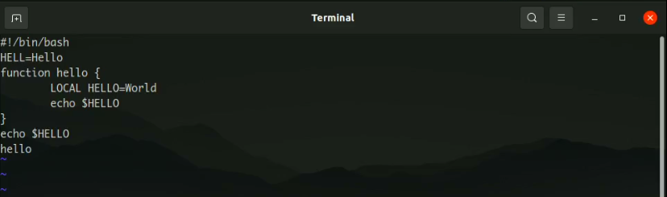

# Текстовой редактор vi

---

## Цель работы:

Познакомиться с операционной системой Linux. Получить практические навыки работы с редактором vi, установленным по умолчанию практически во всех дистрибутивах.

---

## Основные этапы выполнения работы

**1.** Создали каталог /work/os/lab06 и там создали файл hello.sh и вызвали редактор vi.

**2.** Нажали клавишу i и ввели необходимый текст. После чего сохранили изменения и вышли из редактора.

{ #fig:001 width=70% }

---

## Основные этапы выполнения работы

**3.** Сделали файл hello.sh исполняемым.

**4.** Вновь открыли наш файл в редакторе vi, дописали к слову HELL букву O в конце, стерли LOCAL и вместо него написали local.

**5.** Вставили в последнюю строку текст echo $HELLO. Удалили её, после чего отменили изменения и она вновь вернулась.

**6.** Ответили на контрольные вопросы.

---

## Вывод:

Мы познакомились с операционной системой Linux. Получили практические навыки работы с редактором vi, установленным по умолчанию практически во всех дистрибутивах.