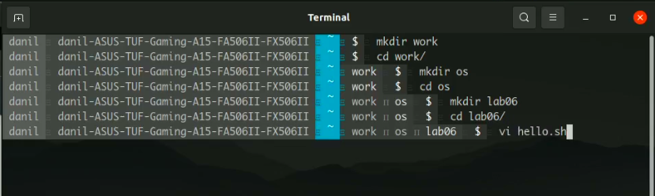
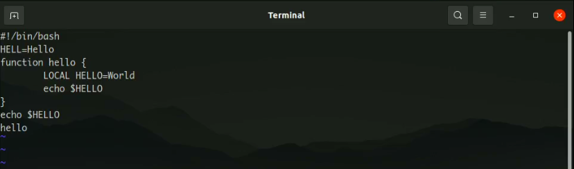
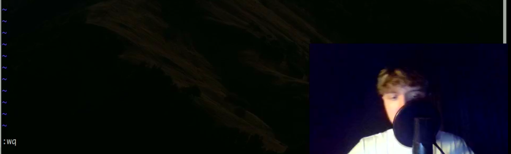
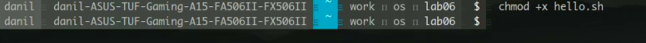
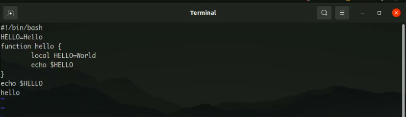
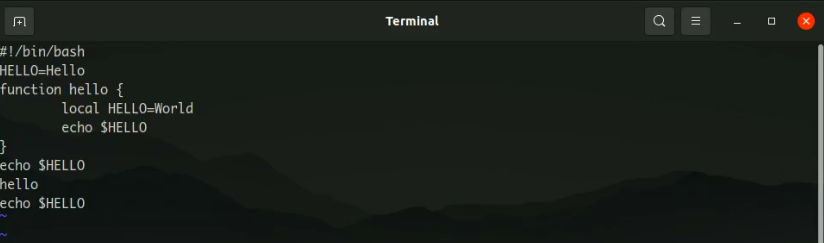

---
## Front matter
title: "Лабораторная работа №8"
subtitle: "Текстовой редактор vi"
author: "Перевощиков Данил Алексеевич"

## Generic otions
lang: ru-RU
toc-title: "Содержание"

## Bibliography
bibliography: bib/cite.bib
csl: pandoc/csl/gost-r-7-0-5-2008-numeric.csl

## Pdf output format
toc: true # Table of contents
toc-depth: 2
lof: true # List of figures
lot: true # List of tables
fontsize: 12pt
linestretch: 1.5
papersize: a4
documentclass: scrreprt
## I18n polyglossia
polyglossia-lang:
  name: russian
  options:
	- spelling=modern
	- babelshorthands=true
polyglossia-otherlangs:
  name: english
## I18n babel
babel-lang: russian
babel-otherlangs: english
## Fonts
mainfont: PT Serif
romanfont: PT Serif
sansfont: PT Sans
monofont: PT Mono
mainfontoptions: Ligatures=TeX
romanfontoptions: Ligatures=TeX
sansfontoptions: Ligatures=TeX,Scale=MatchLowercase
monofontoptions: Scale=MatchLowercase,Scale=0.9
## Biblatex
biblatex: true
biblio-style: "gost-numeric"
biblatexoptions:
  - parentracker=true
  - backend=biber
  - hyperref=auto
  - language=auto
  - autolang=other*
  - citestyle=gost-numeric
## Pandoc-crossref LaTeX customization
figureTitle: "Рис."
tableTitle: "Таблица"
listingTitle: "Листинг"
lofTitle: "Список иллюстраций"
lotTitle: "Список таблиц"
lolTitle: "Листинги"
## Misc options
indent: true
header-includes:
  - \usepackage{indentfirst}
  - \usepackage{float} # keep figures where there are in the text
  - \floatplacement{figure}{H} # keep figures where there are in the text
---

# Цель работы

Познакомиться с операционной системой Linux. Получить практические навыки работы с редактором vi, установленным по умолчанию практически во всех дистрибутивах.

# Ход работы

**1.** Создали каталог /work/os/lab06 и там создали файл hello.sh и вызвали редактор vi.(рис. [-@fig:001])

{ #fig:001 width=70% }

**2.** Нажали клавишу i и ввели необходимый текст.(рис. [-@fig:002])

{ #fig:002 width=70% }

Далее нажали : и нажали wq для записи и выхода из редактора.(рис. [-@fig:003])

{ #fig:003 width=70% }

**3.** Сделали файл hello.sh исполняемым.(рис. [-@fig:004])

{ #fig:004 width=70% }

**4.** Вновь открыли наш файл в редакторе vi, дописали к слову HELL букву O в конце, стерли LOCAL и вместо него написали local.(рис. [-@fig:005])

{ #fig:005 width=70% }

Вставили в последнюю строку текст echo $HELLO. Удалили её, после чего отменили изменения и она вновь вернулась.(рис. [-@fig:006])

{ #fig:006 width=70% }

# Вывод

Мы познакомились с операционной системой Linux. Получили практические навыки работы с редактором vi, установленным по умолчанию практически во всех дистрибутивах.

# Контрольные вопросы

1. *Дайте краткую характеристику режимам работы редактора vi.*

Редактор vi имеет три режима работы:
- командный режим — предназначен для ввода команд редактирования и навигации по
редактируемому файлу;
- режим вставки — предназначен для ввода содержания редактируемого файла;
- режим последней (или командной) строки — используется для записи изменений в файл и выхода из редактора.

2. *Как выйти из редактора, не сохраняя произведённые изменения?

Набрать символ :, после него q (или q!), если требуется выйти из редактора без сохранения.

3. *Назовите и дайте краткую характеристику командам позиционирования*

- 0 (ноль) — переход в начало строки;
- $ — переход в конец строки;
- G — переход в конец файла;
- 𝑛 G — переход на строку с номером 𝑛.

4. *Что для редактора vi является словом?*

Любая последовательность букв.

5. *Каким образом из любого места редактируемого файла перейти в начало (конец) файла?*

- G — переход в конец файла.

6. *Назовите и дайте краткую характеристику основным группам команд редактирования*

Вставка текста
- а — вставить текст после курсора;
- А — вставить текст в конец строки;
- i — вставить текст перед курсором;
- 𝑛 i — вставить текст 𝑛 раз;
- I — вставить текст в начало строки.

Вставка строки
- о — вставить строку под курсором;
- О — вставить строку над курсором.

Удаление текста
- x — удалить один символ в буфер;
- d w — удалить одно слово в буфер;
- d $ — удалить в буфер текст от курсора до конца строки;
- d 0 — удалить в буфер текст от начала строки до позиции курсора;
- d d — удалить в буфер одну строку;
- 𝑛 d d — удалить в буфер 𝑛 строк.

Отмена и повтор произведённых изменений
- u — отменить последнее изменение;
- . — повторить последнее изменение.

Копирование текста в буфер
- Y — скопировать строку в буфер;
- 𝑛 Y — скопировать 𝑛 строк в буфер;
- y w — скопировать слово в буфер.

Вставка текста из буфера
- p — вставить текст из буфера после курсора;
- P — вставить текст из буфера перед курсором.

Замена текста
- c w — заменить слово;
- 𝑛 c w — заменить 𝑛 слов;
- c $ — заменить текст от курсора до конца строки;
- r — заменить слово;
- R — заменить текст.

Поиск текста
- / текст — произвести поиск вперёд по тексту указанной строки символов текст;
- ? текст — произвести поиск назад по тексту указанной строки символов текст.

7. *Необходимо заполнить строку символами $. Каковы ваши действия?*

Использую команду с$ $.

8. *. Как отменить некорректное действие, связанное с процессом редактирования?*

- u — отменить последнее изменение;

9. *Назовите и дайте характеристику основным группам команд режима последней строки.*

Копирование и перемещение текста
- : 𝑛,𝑚 d — удалить строки с 𝑛 по 𝑚;
- : 𝑖,𝑗 m 𝑘 — переместить строки с 𝑖 по 𝑗, начиная со строки 𝑘;
- : 𝑖,𝑗 t 𝑘 — копировать строки с 𝑖 по 𝑗 в строку 𝑘;
- : 𝑖,𝑗 w имя-файла — записать строки с 𝑖 по 𝑗 в файл с именем имя-файла.

Запись в файл и выход из редактора
- : w — записать изменённый текст в файл, не выходя из vi;
- : w имя-файла — записать изменённый текст в новый файл с именем имя-файла;
- : w ! имя-файла — записать изменённый текст в файл с именем имя-файла;
- : w q — записать изменения в файл и выйти из vi;
- : q — выйти из редактора vi;
- : q ! — выйти из редактора без записи;
- : e ! — вернуться в командный режим, отменив все изменения, произведённые
со времени последней записи.

10. *Как определить, не перемещая курсора, позицию, в которой заканчивается строка?*

- $ — переход в конец строки;

11. *Выполните анализ опций редактора vi (сколько их, как узнать их назначение и т.д.).*

Опции редактора vi позволяют настроить рабочую среду. Для задания опций используется команда set (в режиме последней строки):
- : set all — вывести полный список опций;
- : set nu — вывести номера строк;
- : set list — вывести невидимые символы;
- : set ic — не учитывать при поиске, является ли символ прописным или строчным.

12. *Как определить режим работы редактора vi?*

В командном режиме доступна только навигация и ввод команд редактирования, а в режиме вставки можно редактировать файл.