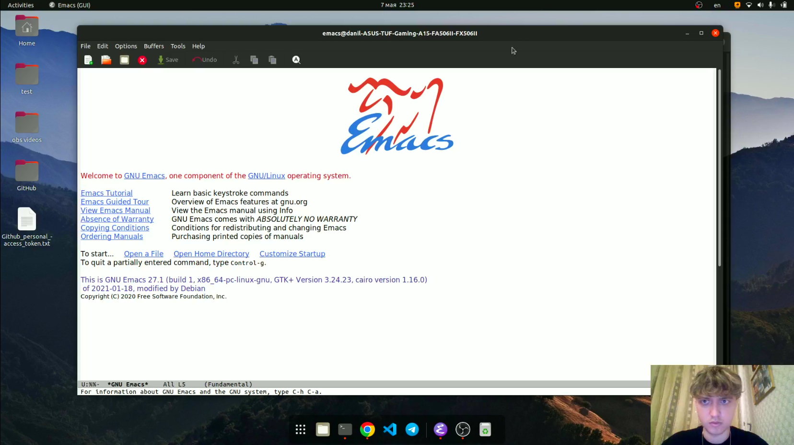

# Текстовой редактор emacs

---

## Цель работы:

Познакомиться с операционной системой Linux. Получить практические навыки работы с редактором Emacs.

---

## Основные этапы выполнения работы

**1.** Скачали текстовый редактор emacs командой *sudo apt install emacs*.

**2.** Открыли emacs, создали файл lab07.sh с помощью комбинации *Ctrl-x* *Ctrl-f*, набрали в нём необходимый текст и сохранили файл с помощью комбинации *Ctrl-x* *Ctrl-s*.

{ #fig:002 width=70% }

---

## Основные этапы выполнения работы

**3.** Проделали с текстом стандартные процедуры редактирования:

- Вырезание строки (C-k)
- Вставка (C-y)
- Выделение (C-Space)
- Копия области в буфер обмена (M-w)
- Вырезание области (C-w).
- Отмена последнего действия (C-/)

---

## Основные этапы выполнения работы

**4.** Научились использовать команды по перемещению курсора.

**5.** Научились управлять буферами.

**6.** Научились управлять окнами.

**7.** Изучили режим поиска.

**8.** Ответили на контрольные вопросы.

---

## Вывод:

Познакомились с операционной системой Linux. Получили практические навыки работы с редактором Emacs.