---
## Front matter
title: "Лабораторная работа №9"
subtitle: "Текстовой редактор emacs"
author: "Перевощиков Данил Алексеевич"

## Generic otions
lang: ru-RU
toc-title: "Содержание"

## Bibliography
bibliography: bib/cite.bib
csl: pandoc/csl/gost-r-7-0-5-2008-numeric.csl

## Pdf output format
toc: true # Table of contents
toc-depth: 2
lof: true # List of figures
lot: true # List of tables
fontsize: 12pt
linestretch: 1.5
papersize: a4
documentclass: scrreprt
## I18n polyglossia
polyglossia-lang:
  name: russian
  options:
	- spelling=modern
	- babelshorthands=true
polyglossia-otherlangs:
  name: english
## I18n babel
babel-lang: russian
babel-otherlangs: english
## Fonts
mainfont: PT Serif
romanfont: PT Serif
sansfont: PT Sans
monofont: PT Mono
mainfontoptions: Ligatures=TeX
romanfontoptions: Ligatures=TeX
sansfontoptions: Ligatures=TeX,Scale=MatchLowercase
monofontoptions: Scale=MatchLowercase,Scale=0.9
## Biblatex
biblatex: true
biblio-style: "gost-numeric"
biblatexoptions:
  - parentracker=true
  - backend=biber
  - hyperref=auto
  - language=auto
  - autolang=other*
  - citestyle=gost-numeric
## Pandoc-crossref LaTeX customization
figureTitle: "Рис."
tableTitle: "Таблица"
listingTitle: "Листинг"
lofTitle: "Список иллюстраций"
lotTitle: "Список таблиц"
lolTitle: "Листинги"
## Misc options
indent: true
header-includes:
  - \usepackage{indentfirst}
  - \usepackage{float} # keep figures where there are in the text
  - \floatplacement{figure}{H} # keep figures where there are in the text
---

# Цель работы

Познакомиться с операционной системой Linux. Получить практические навыки работы с редактором Emacs.

# Ход работы

**1.** Скачали текстовый редактор emacs командой *sudo apt install emacs*.(рис. [-@fig:001])

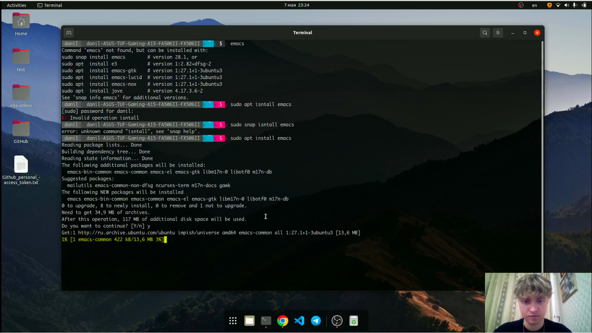{ #fig:001 width=70% }

**2.** Открыли emacs (рис. [-@fig:002]), создали файл lab07.sh с помощью комбинации *Ctrl-x* *Ctrl-f*, набрали в нём необходимый текст и сохранили файл с помощью комбинации *Ctrl-x* *Ctrl-s*.(рис. [-@fig:003])

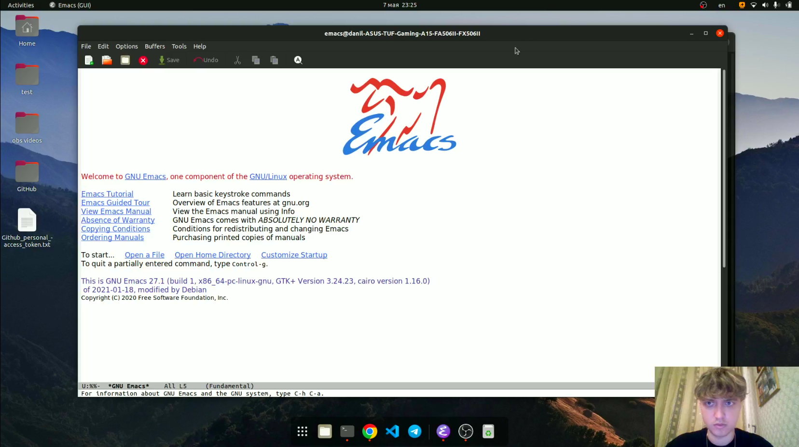{ #fig:002 width=70% }

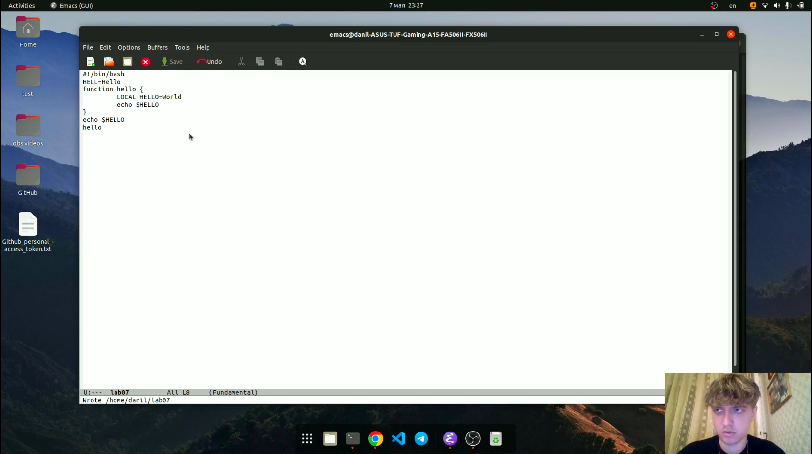{ #fig:003 width=70% }

**3.** Проделали с текстом стандартные процедуры редактирования:

**3.1** Вырезали одной командой целую строку (С-k).(рис. [-@fig:004])

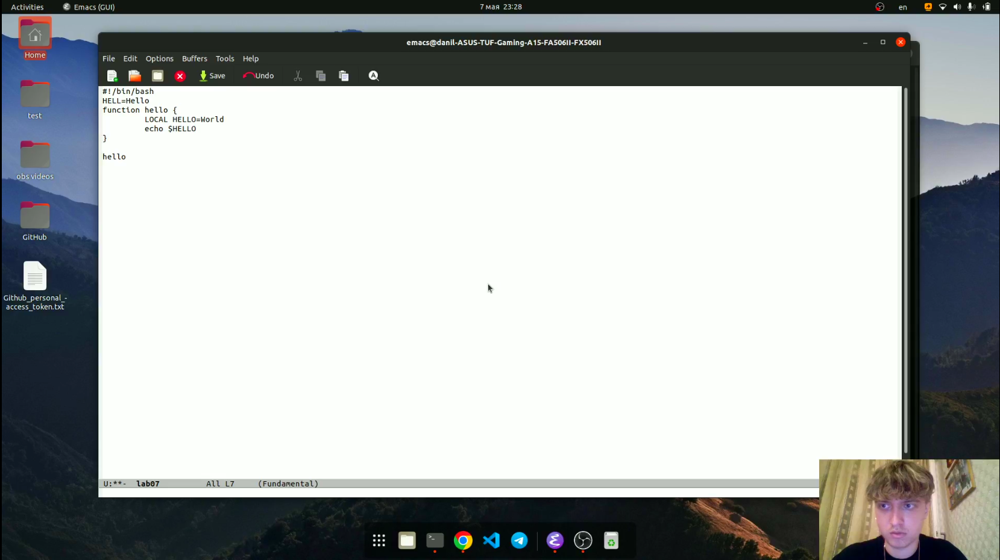{ #fig:004 width=70% }

**3.2** Вставили эту строку в конец файла (C-y).(рис. [-@fig:005])

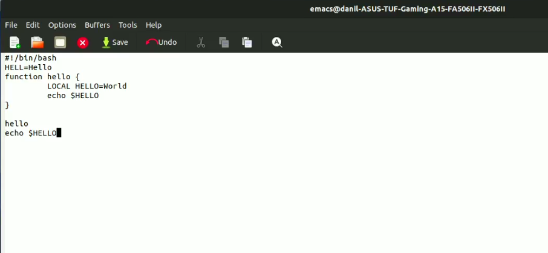{ #fig:005 width=70% }

**3.3** Выделили область текста (C-space) и скопировали её в буфер обмена (M-w).(рис. [-@fig:006])

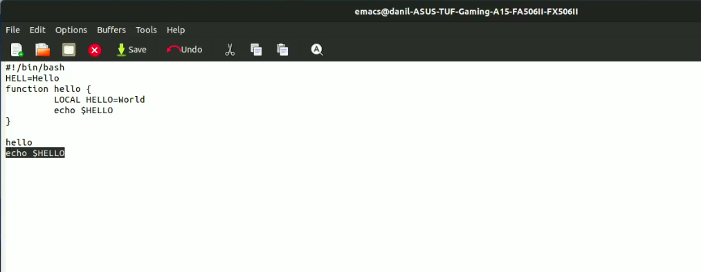{ #fig:006 width=70% }

**3.4** Вставили область в конец файла (C-y).(рис. [-@fig:007])

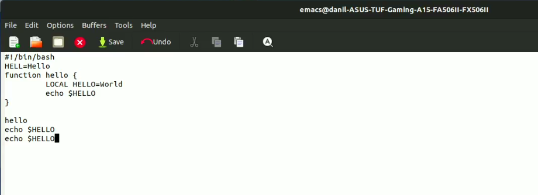{ #fig:007 width=70% }
 
**3.5** Вновь выделили эту область и на этот раз вырезали её (C-w), после чего отменили последнее действие (C-/).(рис. [-@fig:008])

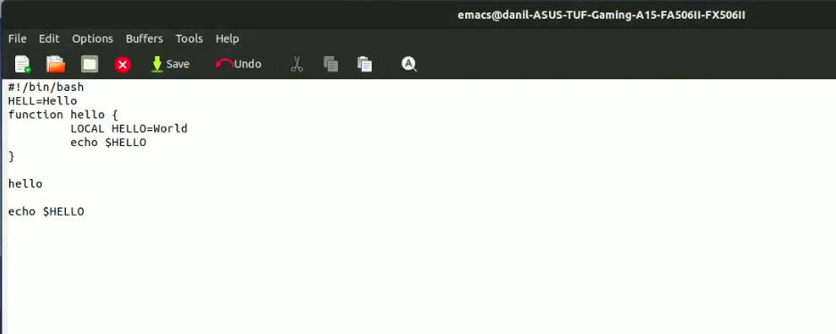{ #fig:008 width=70% }

**4.** Научились использовать команды по перемещению курсора.

**4.1** Переместили курсор в начало строки (C-a).

**4.2** Переместили курсор в конец строки (C-e)

**4.3** Переместили курсор в начало буфера (M-<).

**4.4** . Переместили курсор в конец буфера (M->).

**5.** Научились управлять буферами:

**5.1** Вывести список активных буферов на экран (C-x C-b).(рис. [-@fig:009])

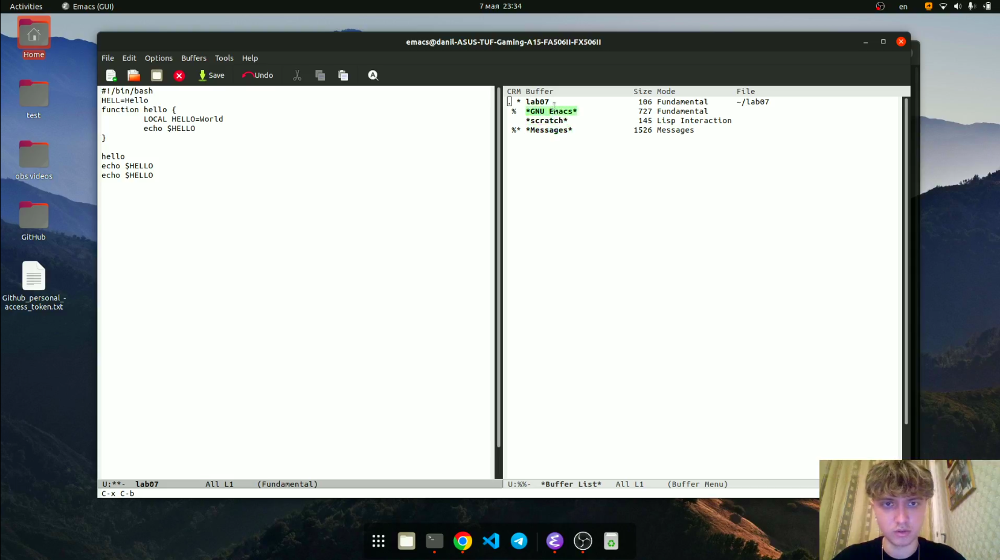{ #fig:009 width=70% }

**5.2** Переместились во вновь открытое окно (C-x) со списком открытых буферов и переключились на другой буфер и затем закрыли это окно.(рис. [-@fig:010])

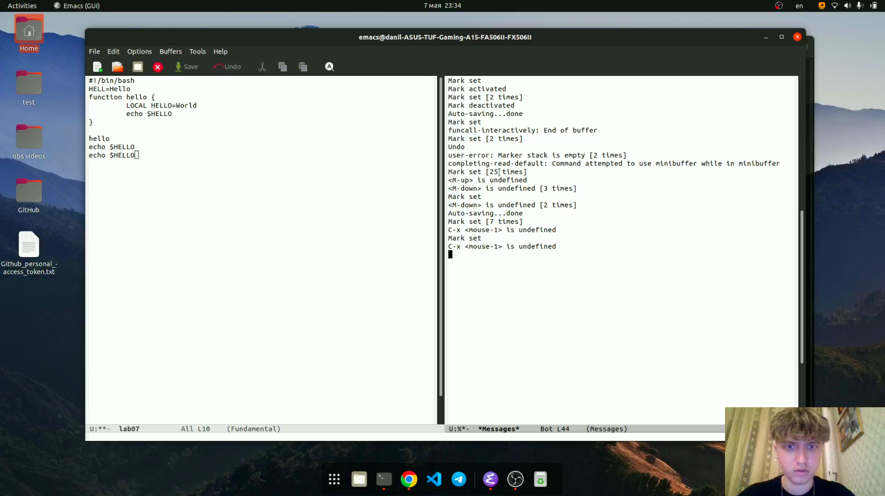{ #fig:010 width=70% }

**5.3** Теперь вновь переключились между буферами, но уже без вывода их списка на экран (C-x b).(рис. [-@fig:011])

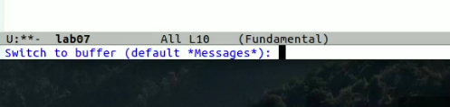{ #fig:011 width=70% }

**6.** Научились управлять окнами:

**6.1** Поделили фрейм на 4 части: разделили фрейм на два окна по вертикали (C-x 3), а затем каждое из этих окон на две части по горизонтали (C-x 2).(рис. [-@fig:012])

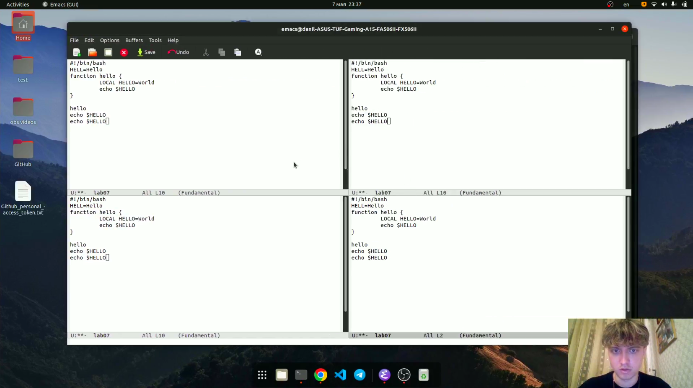{ #fig:012 width=70% }

**6.2** В каждом из четырёх созданных окон открыли новый буфер (файл) и ввели несколько строк текста.(рис. [-@fig:013])

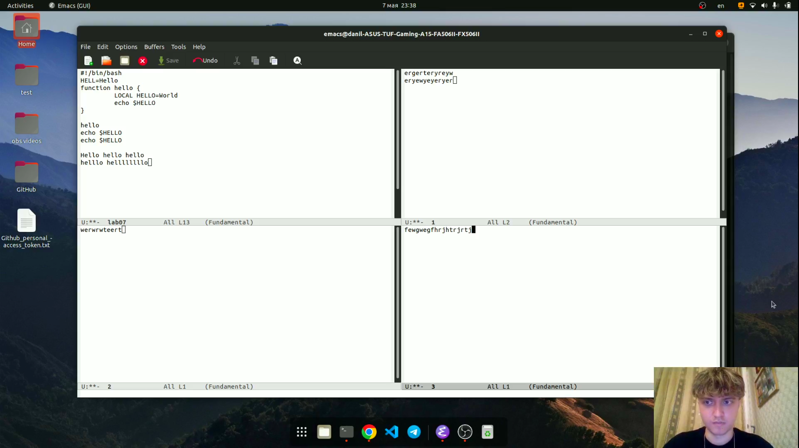{ #fig:013 width=70% }

**7.** Изучили режим поиска:

**7.1** Переключились в режим поиска (C-s) и нашли несколько слов, присутствующих в тексте. Попереключались  между результатами поиска, нажимая C-s. Затем вышли из режима поиска, нажав C-g.(рис. [-@fig:014])

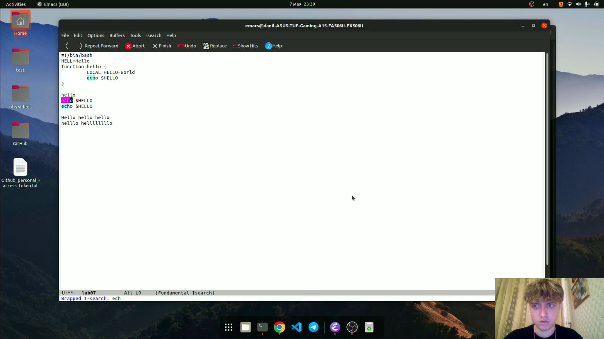{ #fig:014 width=70% }

**7.2** Перешли в режим поиска и замены (M-%), ввели текст, который следует найти и заменить (hello), нажали Enter , затем введите текст для замены (bye). После того как подсветились результаты поиска, нажали ! для подтверждения замены.(рис. [-@fig:015;-@fig:016;-@fig:017]]])

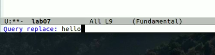{ #fig:015 width=70% }

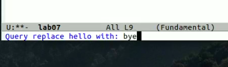{ #fig:016 width=70% }

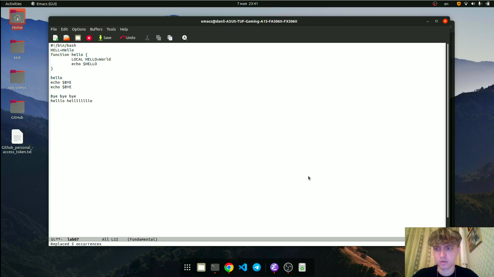{ #fig:017 width=70% }

**7.3** Испробовали другой режим поиска, нажав M-s o. Он отличается от обычного режима поиска тем, что выводит результаты поиска в отдельный буфер.(рис. [-@fig:018])

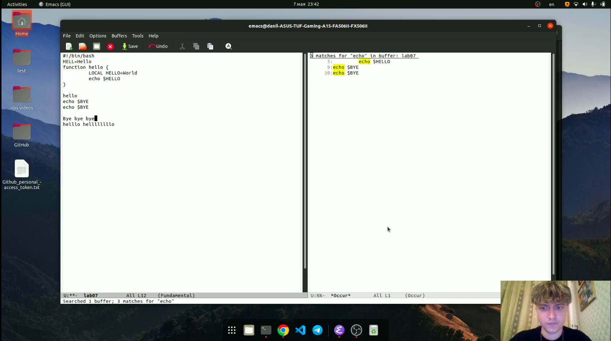{ #fig:018 width=70% }

# Вывод

Познакомились с операционной системой Linux. Получили практические навыки работы с редактором Emacs.

# Контрольные вопросы

1. *Кратко охарактеризуйте редактор emacs.*

Emacs — один из наиболее мощных и широко распространённых редакторов, используемых в мире Unix. По популярности он соперничает с редактором vi и его клонами. В зависимости от ситуации, Emacs может быть:

- текстовым редактором;
- программой для чтения почты и новостей Usenet;
- интегрированной средой разработки (IDE);
- операционной системой;
- всем, чем угодно.

2. *Какие особенности данного редактора могут сделать его сложным для освоения новичком?*

Интерфейс и большое количество непривычных горячих клавиш.

3. *Своими словами опишите, что такое буфер и окно в терминологии emacs’а.*

Буфер — объект, представляющий какой-либо текст. Окно — прямоугольная область фрейма, отображающая один из буферов.

4. *Можно ли открыть больше 10 буферов в одном окне?*

Нет, нельзя.

5. *Какие буферы создаются по умолчанию при запуске emacs?*

GNU Emacs, scratch, Messages.

6. *Какие клавиши вы нажмёте, чтобы ввести следующую комбинацию C-c | и C-c C-|?*

Ctrl + c + Shift + \

Ctrl + c; Ctrl + Shift + \

7. *Как поделить текущее окно на две части?*

Комбинацией клавиш C-x 3 - по вертикали, C-x 2 - по горизонтали.

8. *В каком файле хранятся настройки редактора emacs?*

Настройки emacs хранятся в файле .emacs, который хранится в домашней дирректории пользователя.

9. *Какую функцию выполняет клавиша <- и можно ли её переназначить?*

Данная клавиша удаляет один символ.

10. *Какой редактор вам показался удобнее в работе vi или emacs? Поясните почему*

На мой взгляд редактор emacs намного удобнее в работе если сравнивать с vi. Emacs имеет свой красивый интерфейс и очень много возможностей.