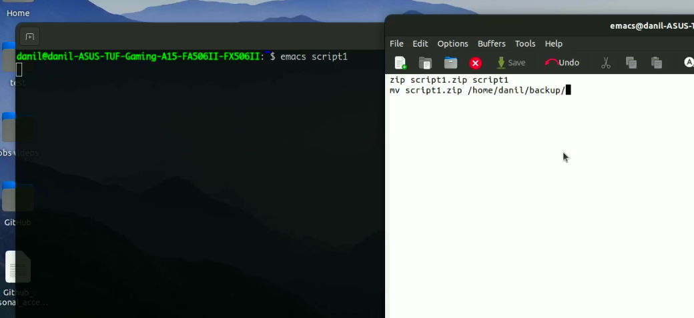
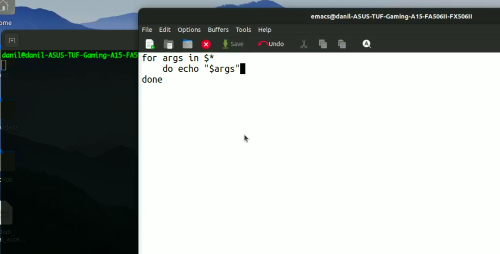
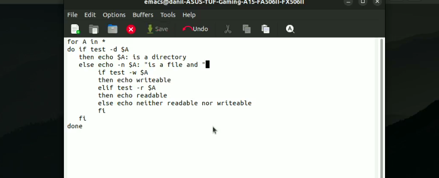
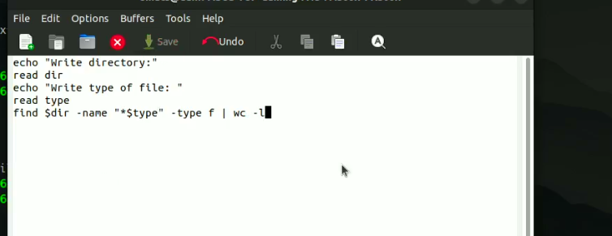

# Программирование в командном процессоре ОС UNIX. Командные файлы

---

## Цель работы:

Изучить основы программирования в оболочке ОС UNIX/Linux. Научиться писать небольшие командные файлы.

---

## Основные этапы выполнения работы

**1.** Написали скрипт, который при запуске делает резервную копию самого себя (то есть файла, в котором содержится его исходный код) в другую директорию backup в домашнем каталоге. При этом файл архивируется архиватором zip.(рис. [-@fig:001])

{ #fig:001 width=70% }

---

## Основные этапы выполнения работы

**2.** Написали пример командного файла, обрабатывающего любое произвольное число аргументов командной строки, в том числе превышающее десять. Наш скрипт последовательно печатает значения всех переданных аргументов.(рис. [-@fig:002])

{ #fig:002 width=70% }

---

## Основные этапы выполнения работы

**3.** Написали командный файл — аналог команды ls (без использования самой этой команды и команды dir). Он выдает информацию о нужном каталоге и выводит информацию о возможностях доступа к файлам этого каталога.(рис. [-@fig:003])

{ #fig:003 width=70% }

---

## Основные этапы выполнения работы

**4.** Написали командный файл, который получает в качестве аргумента командной строки формат файла (.txt, .doc, .jpg, .pdf и т.д.) и вычисляет количество таких файлов в указанной директории. Путь к директории также передаётся в виде аргумента командной строки.(рис. [-@fig:004])

{ #fig:004 width=70% }

---

## Вывод:

Изучили основы программирования в оболочке ОС UNIX/Linux. Научились писать небольшие командные файлы.