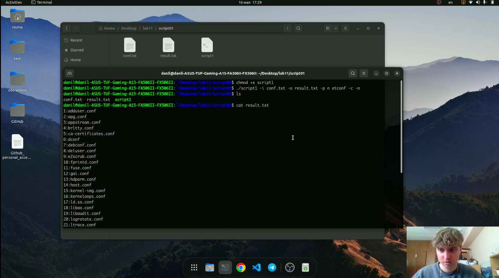
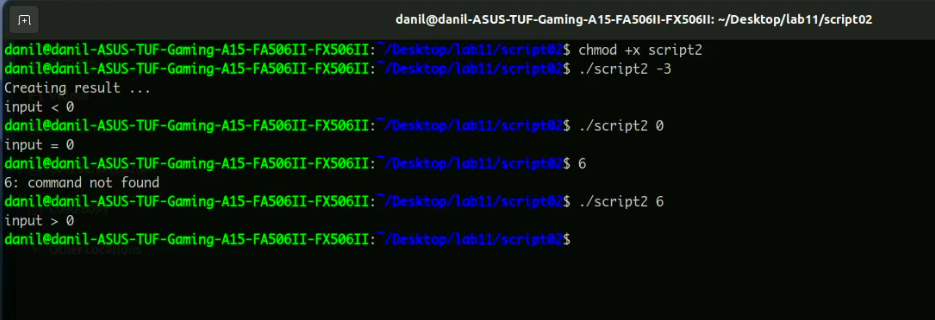
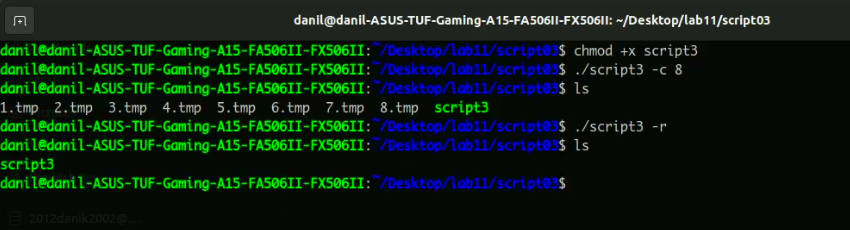
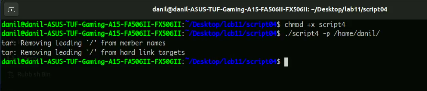
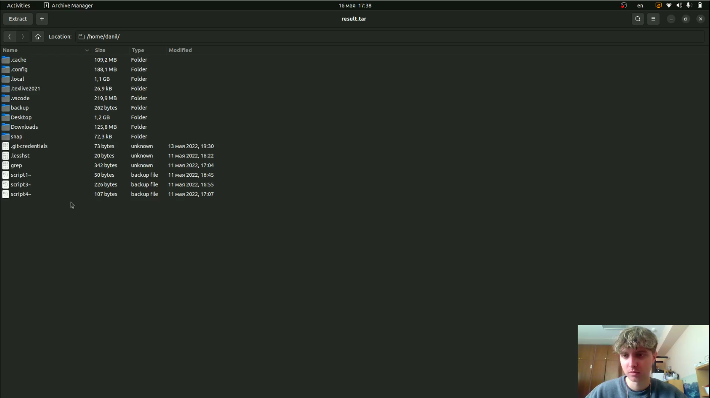

# Программирование в командном процессоре ОС UNIX. Ветвления и циклы.

---

## Цель работы:

Изучить основы программирования в оболочке ОС UNIX. Научится писать более
сложные командные файлы с использованием логических управляющих конструкций
и циклов.

---

## Основные этапы выполнения работы

1. Написали командный файл, который анализирует командную строку с ключами -i, -o, -p, -c, -n. А затем ищет в указанном файле нужные строки, определяемые ключом -p.(рис. [-@fig:001])

{ #fig:001 width=70% }

---

## Основные этапы выполнения работы

2. Написали на языке с++ программу, которая вводит число и определяет, является ли оно больше нуля, меньше нуля или равно нулю. Затем программа завершается с помощью
функции exit(n), передавая информацию о коде завершения в оболочку. Командный файл вызывает эту программу и, проанализировав с помощью команды $?, выдает сообщение о том, какое число было введено.(рис. [-@fig:002])

{ #fig:002 width=70% }

---

## Основные этапы выполнения работы

3. Написали командный файл, создающий указанное число файлов, пронумерованных
последовательно от 1 до N. Число файлов, которые необходимо создать, передаётся в аргументы командной строки. Этот же командный файл умеет удалять все созданные им файлы (если они существуют).(рис. [-@fig:003])

{ #fig:003 width=70% }

---

## Основные этапы выполнения работы

4. Написали командный файл, который с помощью команды tar запаковывает в архив файлы, которые были изменены менее недели тому назад.(рис. [-@fig:004;-@fig:005])

{ #fig:004 width=70% }

---

## Основные этапы выполнения работы

{ #fig:005 width=70% }

5. Ответили на контрольные вопросы.

---

## Вывод:

Изучили основы программирования в оболочке ОС UNIX. Научились писать более
сложные командные файлы с использованием логических управляющих конструкций
и циклов.