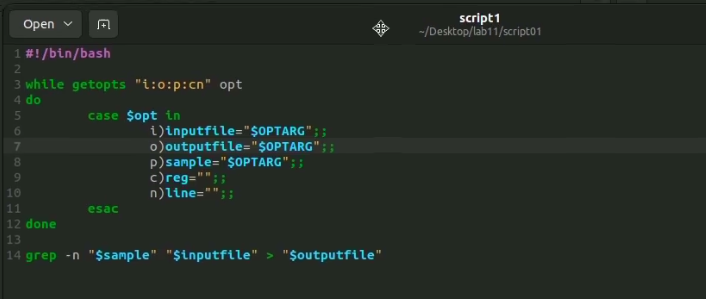
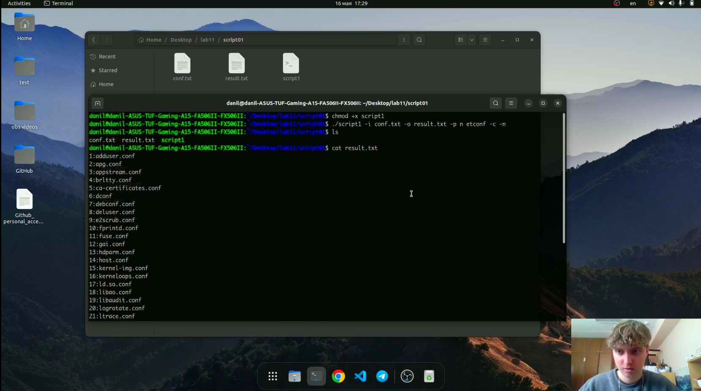
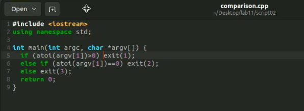
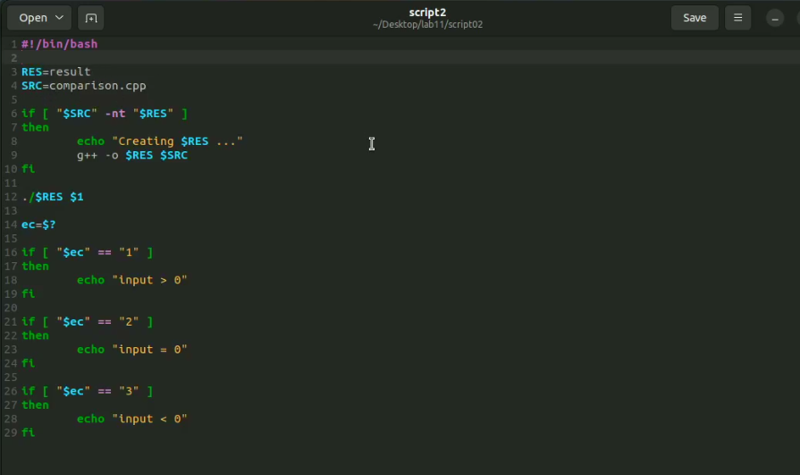
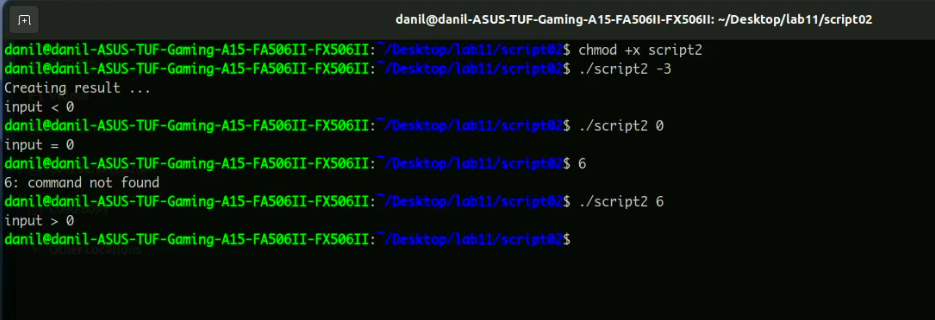
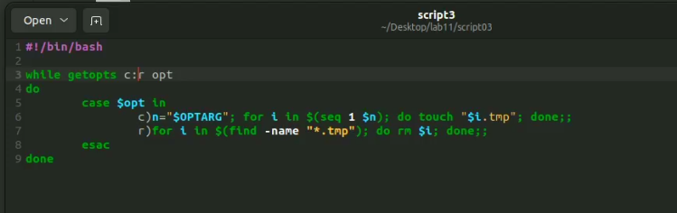
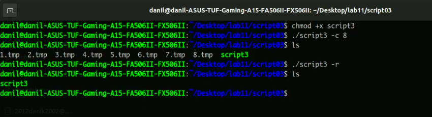
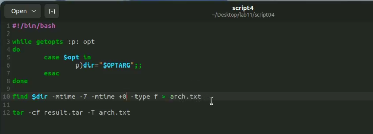
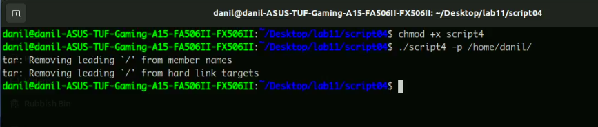
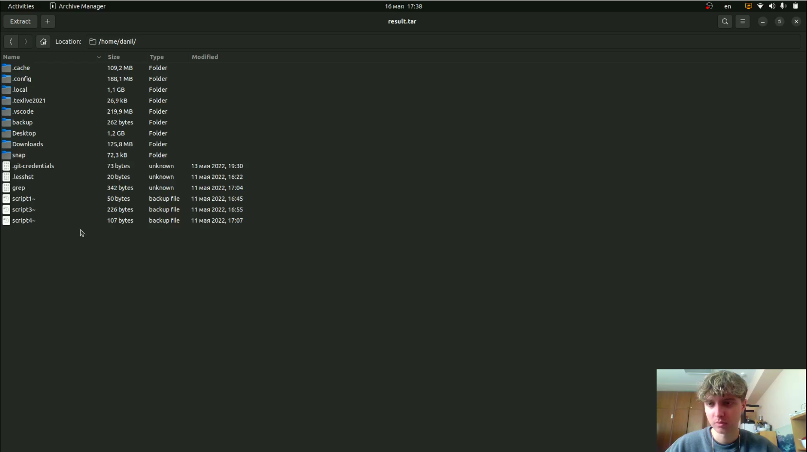

---
## Front matter
title: "Лабораторная работа №11"
subtitle: "Программирование в командном процессоре ОС UNIX. Ветвления и циклы"
author: "Перевощиков Данил Алексеевич"

## Generic otions
lang: ru-RU
toc-title: "Содержание"

## Bibliography
bibliography: bib/cite.bib
csl: pandoc/csl/gost-r-7-0-5-2008-numeric.csl

## Pdf output format
toc: true # Table of contents
toc-depth: 2
lof: true # List of figures
lot: true # List of tables
fontsize: 12pt
linestretch: 1.5
papersize: a4
documentclass: scrreprt
## I18n polyglossia
polyglossia-lang:
  name: russian
  options:
	- spelling=modern
	- babelshorthands=true
polyglossia-otherlangs:
  name: english
## I18n babel
babel-lang: russian
babel-otherlangs: english
## Fonts
mainfont: PT Serif
romanfont: PT Serif
sansfont: PT Sans
monofont: PT Mono
mainfontoptions: Ligatures=TeX
romanfontoptions: Ligatures=TeX
sansfontoptions: Ligatures=TeX,Scale=MatchLowercase
monofontoptions: Scale=MatchLowercase,Scale=0.9
## Biblatex
biblatex: true
biblio-style: "gost-numeric"
biblatexoptions:
  - parentracker=true
  - backend=biber
  - hyperref=auto
  - language=auto
  - autolang=other*
  - citestyle=gost-numeric
## Pandoc-crossref LaTeX customization
figureTitle: "Рис."
tableTitle: "Таблица"
listingTitle: "Листинг"
lofTitle: "Список иллюстраций"
lotTitle: "Список таблиц"
lolTitle: "Листинги"
## Misc options
indent: true
header-includes:
  - \usepackage{indentfirst}
  - \usepackage{float} # keep figures where there are in the text
  - \floatplacement{figure}{H} # keep figures where there are in the text
---

# Цель работы

Изучить основы программирования в оболочке ОС UNIX. Научится писать более
сложные командные файлы с использованием логических управляющих конструкций
и циклов.

# Ход работы

**1.** Используя команды getopts grep, написали командный файл, который анализирует
командную строку с ключами:
- -i inputfile — прочитать данные из указанного файла;
- -o outputfile — вывести данные в указанный файл;
- -p шаблон — указать шаблон для поиска;
- -c — различать большие и малые буквы;
- -n — выдавать номера строк.
а затем ищет в указанном файле нужные строки, определяемые ключом -p.(рис. [-@fig:001])

{ #fig:001 width=70% }

Мы использовали файл conf.txt из одной из прошлых работ.(рис. [-@fig:002])

{ #fig:002 width=70% }

**2.** Написали на языке с++ программу, которая вводит число и определяет, является ли оно больше нуля, меньше нуля или равно нулю. Затем программа завершается с помощью
функции exit(n), передавая информацию о коде завершения в оболочку. Командный файл вызывает эту программу и, проанализировав с помощью команды $?, выдает сообщение о том, какое число было введено.(рис. [-@fig:003;-@fig:004;-@fig:005])

{ #fig:003 width=70% }

{ #fig:004 width=70% }

{ #fig:005 width=70% }

**3.** Написали командный файл, создающий указанное число файлов, пронумерованных
последовательно от 1 до N. Число файлов, которые необходимо создать, передаётся в аргументы командной строки. Этот же командный файл умеет удалять все созданные им файлы (если они существуют).(рис. [-@fig:006;-@fig:007])

{ #fig:006 width=70% }

{ #fig:007 width=70% }

**4.** Написали командный файл, который с помощью команды tar запаковывает в архив файлы, которые были изменены менее недели тому назад.(рис. [-@fig:008;-@fig:009])

{ #fig:008 width=70% }

{ #fig:009 width=70% }

После этого создался архив result.tar.(рис. [-@fig:010])

{ #fig:010 width=70% }

# Вывод

Изучили основы программирования в оболочке ОС UNIX. Научились писать более
сложные командные файлы с использованием логических управляющих конструкций
и циклов.

# Контрольные вопросы

1. *Каково предназначение команды getopts?*

Осуществляет синтаксический анализ командной строки, выделяя флаги, и используется
для объявления переменных.

2. *Какое отношение метасимволы имеют к генерации имён файлов?*

При перечислении имен файлов текущего каталога можно использовать следующие символы:
- ```*``` — соответствует произвольной, в том числе и пустой строке;
- ```?``` — соответствует любому одному символу;
- ```[c1-c1]``` — соответствует любому символу, лексикографически на ходящемуся между символами c1 и с2.
- ```echo *``` — выведет имена всех файлов текущего каталога, что представляет собой простейший аналог команды ls;
- ```ls *.c``` — выведет все файлы с последними двумя символами, равными .c.
- ```echo prog.?``` — выдаст все файлы, состоящие из пяти или шести символов, первыми пятью символами которых являются prog. .
- ```[a-z]*``` — соответствует произвольному имени файла в текущем каталоге, начинающемуся с любой строчной буквы латинского алфавита.

3. *Какие операторы управления действиями вы знаете?*

Часто бывает необходимо обеспечить проведение каких-либо действий циклически и управление дальнейшими действиями в зависимости от результатов проверки некоторого условия. Для решения подобных задач язык программирования bash предоставляет Вам возможность использовать такие управляющие конструкции, как for, case, if и while. С точки зрения командного процессора эти управляющие конструкции являются обычными командами и могут использоваться как при создании командных файлов, так и при работе в интерактивном режиме. Команды, реализующие подобные конструкции, по сути дела являются операторами языка программирования bash. Поэтому при описании языка программирования bash термин оператор будет использоваться наравне с термином команда.

4. *Какие операторы используются для прерывания цикла?*

Два несложных способа позволяют вам прерывать циклы в оболочке bash. Команда break завершает выполнение цикла, а команда continue завершает данную итерацию блока операторов. Команда break полезна для завершения цикла while в ситуациях, когда условие перестает быть правильным. Пример бесконечного цикла while, с прерыванием в момент, когда файл перестает существовать:

- ```while true do```

- ```if [! -f $file] then break```

- ```fi```

- ```sleep 10 done```

5. *Для чего нужны команды false и true?*

Команды ОС UNIX возвращают код завершения, значение которого может быть использовано для принятия решения о дальнейших действиях. Команда test, например, создана специально для использования в командных файлах. Единственная функция этой команды заключается в выработке кода завершения.

6. *Что означает строка if test -f man$s/$i.$s, встреченная в командном файле?*

Введенная строка означает условие существования файла man$s/$i.$s

7. *Объясните различия между конструкциями while и until.*

Если речь идет о 2-х параллельных действиях, то это while. когда мы показываем, что сначала делается 1-е действие. потом оно заканчивается при наступлении 2-го действия, применяем until.