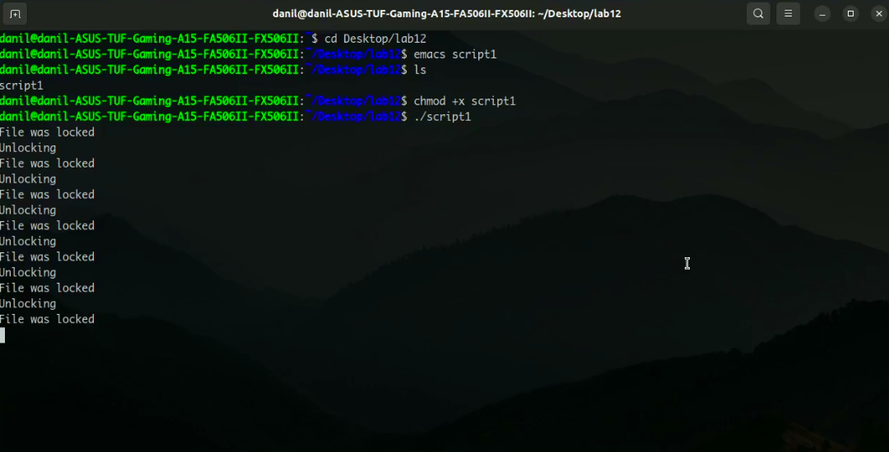
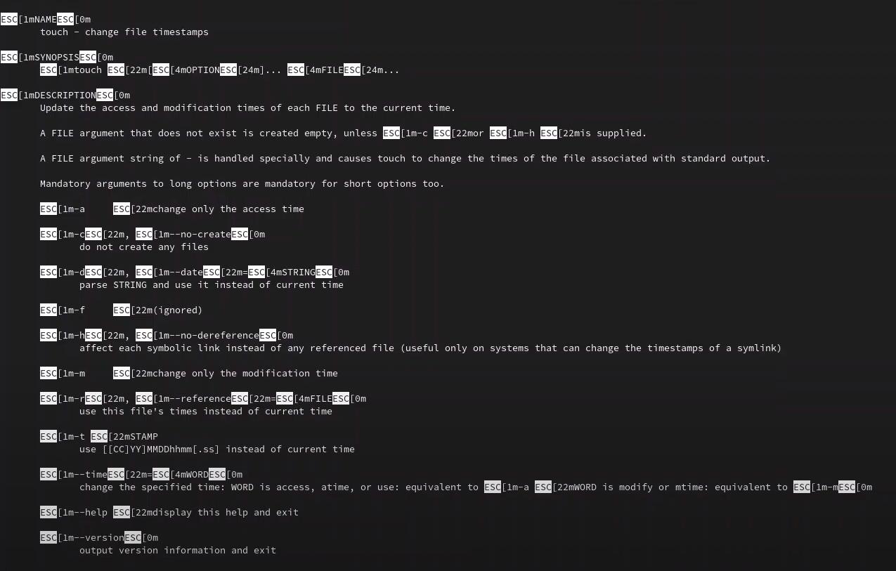
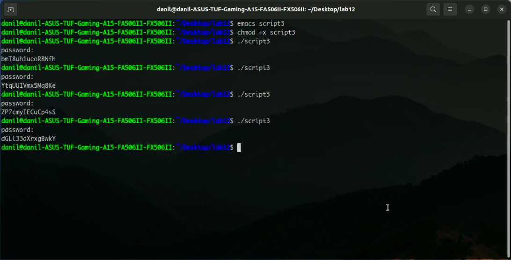

# Программирование в командном процессоре ОС UNIX. Расширенное программирование

---

## Цель работы:

Изучить основы программирования в оболочке ОС UNIX. Научиться писать более
сложные командные файлы с использованием логических управляющих конструкций
и циклов.

---

## Основные этапы выполнения работы

**1.** Написали командный файл, реализующий упрощённый механизм семафоров. Командный файл в течение некоторого времени t1 дожидается освобождения
ресурса, выдавая об этом сообщение, а дождавшись его освобождения, используем его в течение некоторого времени t2<>t1, также выдавая информацию о том, что ресурс используется соответствующим командным файлом (процессом). 
(рис. [-@fig:001])

{ #fig:001 width=70% }

---

## Основные этапы выполнения работы

**2.** Реализовали команду man с помощью командного файла. Изучили содержимое каталога /usr/share/man/man1. В нем находятся архивы текстовых файлов, содержащих справку по большинству установленных в системе программ и команд. Каждый архив можно открыть командой less сразу же просмотрев содержимое справки. Командный файл получает в виде аргумента командной строки название команды и в виде результата выдавает справку об этой команде.(рис. [-@fig:002])

{ #fig:002 width=70% }

---

## Основные этапы выполнения работы

**3.** Используя встроенную переменную $RANDOM, написали командный файл, генерирующий случайную последовательность букв латинского алфавита.(рис. [-@fig:003])

{ #fig:003 width=70% }

---

## Вывод:

Изучили основы программирования в оболочке ОС UNIX. Научились писать более
сложные командные файлы с использованием логических управляющих конструкций
и циклов.