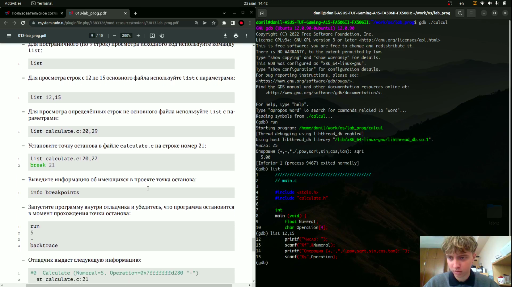

# Средства, применяемые при разработке программного обеспечения в ОС типа UNIX/Linux

---

## Цель работы:

Приобрести простейшие навыки разработки, анализа, тестирования и отладки приложений в ОС типа UNIX/Linux на примере создания на языке программирования С калькулятора с простейшими функциями.

---

## Основные этапы выполнения работы

**1.** В домашнем каталоге создали подкаталог ~/work/os/lab_prog, в нем создали файлы calculate.h, calculate.c, main.c и переписали в них код.

**2.** Выполнили компиляцию программы посредством gcc.

**3.** Создали makefile и исправили его.

---

## Основные этапы выполнения работы

**4.** Запустили наш калькулятор с помощью gdb командой *gdb ./calcul* и командой *run*, проверили его работу. Далее вывели командой *list* первые 9 строк файла main.c и командой *list 12,15* выводим строки с 12 по 15 файла main.c.(рис. [-@fig:001])

{ #fig:001 width=70% } 

---

## Основные этапы выполнения работы

**5.** Создали breakpoint на на 16 строке файла main.c, далее проверили информацию о breakpoints командой *info breakpoints*. После чего запустили калькулятор и убедились, что breakpoint сработал. Посмотрели чему на этом этапе равно значение переменной Numeral и удалили точка останова командой *delete 1*.

**6.** С помощью утилиты splint проанализировали коды файлов calculate.c
и main.c.

---

## Вывод:

Приобрели простейшие навыки разработки, анализа, тестирования и отладки приложений в ОС типа UNIX/Linux на примере создания на языке программирования С калькулятора с простейшими функциями.