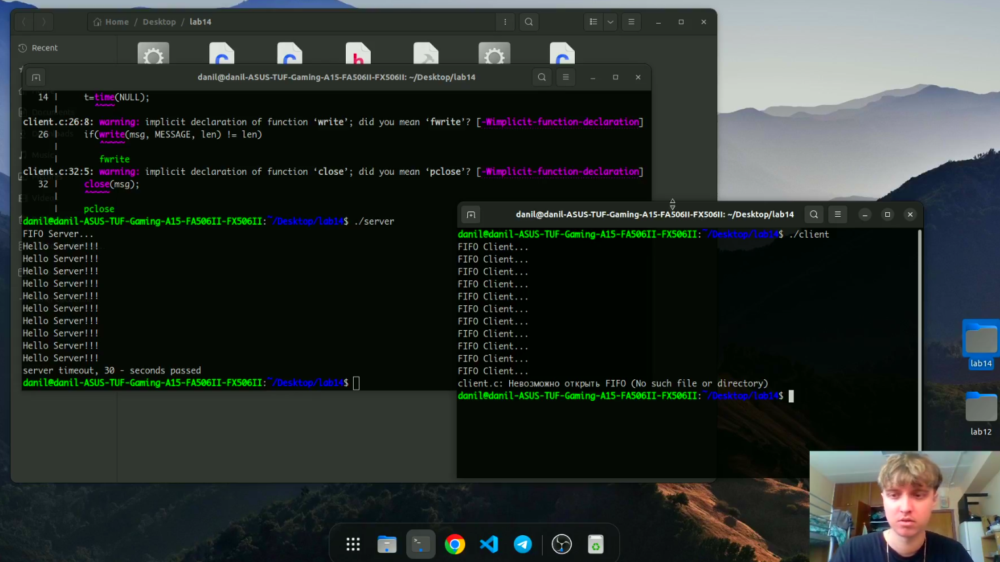

# Именованные каналы

---

## Цель работы:

Приобретение практических навыков работы с именованными каналами.

---

## Основные этапы выполнения работы

**1.** Создали файл common.h, server.c, client.c, client2.c и makefile.

**2.** Запустили makefile командой *make*, создав этим исполняемые файлы.

---

## Основные этапы выполнения работы

**3.** Запустили сначала server, потом в другом терминале client. Каждые 5 секунд выводилось сообщение, работа завершилась через 30 секунд.(рис. [-@fig:001])

{ #fig:001 width=70% }

---

## Вывод:

Мы приобрели практические навыки работы с именованными каналами.