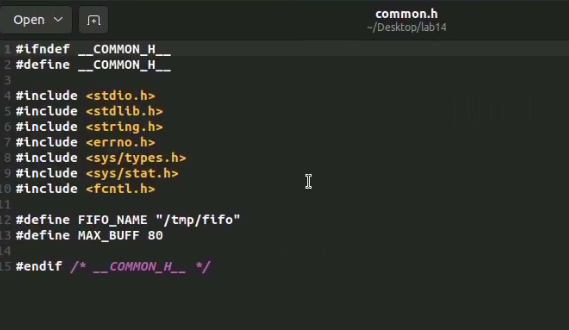
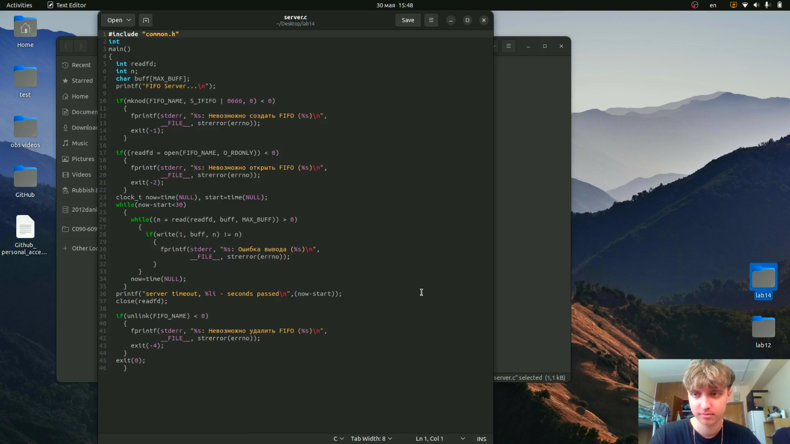
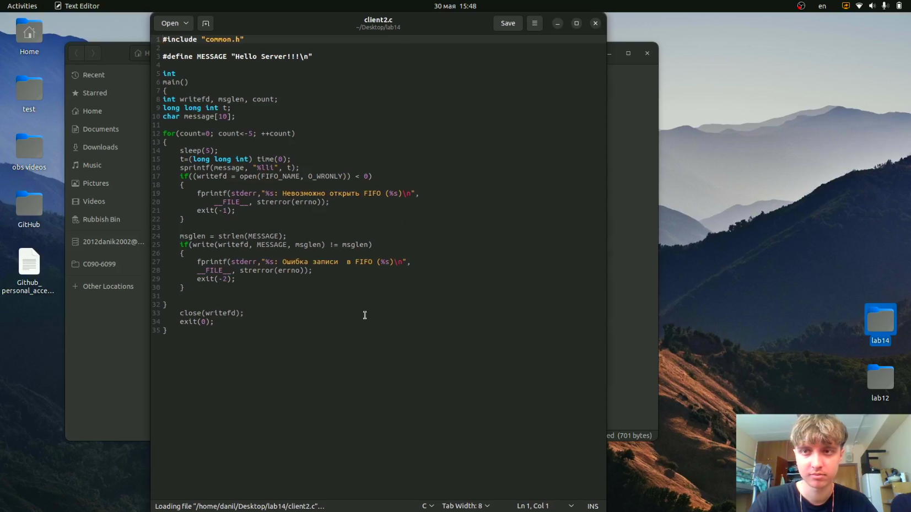
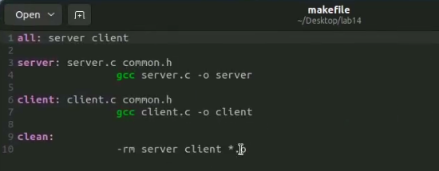
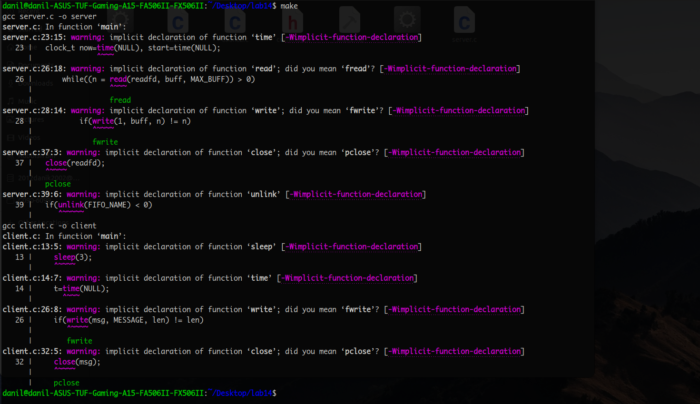
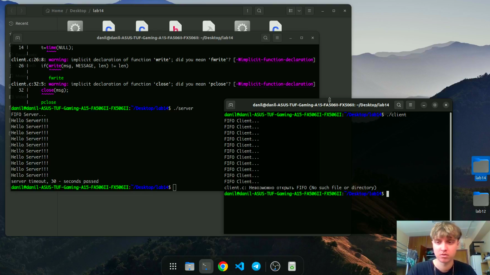

---
## Front matter
title: "Лабораторная работа №14"
subtitle: "Именованные каналы"
author: "Перевощиков Данил Алексеевич"

## Generic otions
lang: ru-RU
toc-title: "Содержание"

## Bibliography
bibliography: bib/cite.bib
csl: pandoc/csl/gost-r-7-0-5-2008-numeric.csl

## Pdf output format
toc: true # Table of contents
toc-depth: 2
lof: true # List of figures
lot: true # List of tables
fontsize: 12pt
linestretch: 1.5
papersize: a4
documentclass: scrreprt
## I18n polyglossia
polyglossia-lang:
  name: russian
  options:
	- spelling=modern
	- babelshorthands=true
polyglossia-otherlangs:
  name: english
## I18n babel
babel-lang: russian
babel-otherlangs: english
## Fonts
mainfont: PT Serif
romanfont: PT Serif
sansfont: PT Sans
monofont: PT Mono
mainfontoptions: Ligatures=TeX
romanfontoptions: Ligatures=TeX
sansfontoptions: Ligatures=TeX,Scale=MatchLowercase
monofontoptions: Scale=MatchLowercase,Scale=0.9
## Biblatex
biblatex: true
biblio-style: "gost-numeric"
biblatexoptions:
  - parentracker=true
  - backend=biber
  - hyperref=auto
  - language=auto
  - autolang=other*
  - citestyle=gost-numeric
## Pandoc-crossref LaTeX customization
figureTitle: "Рис."
tableTitle: "Таблица"
listingTitle: "Листинг"
lofTitle: "Список иллюстраций"
lotTitle: "Список таблиц"
lolTitle: "Листинги"
## Misc options
indent: true
header-includes:
  - \usepackage{indentfirst}
  - \usepackage{float} # keep figures where there are in the text
  - \floatplacement{figure}{H} # keep figures where there are in the text
  
---

# Цель работы

Приобретение практических навыков работы с именованными каналами.

# Ход работы

**1.** Создали файл common.h.(рис. [-@fig:001])

{ #fig:001 width=70% }

**2.** Создали файл server.c.(рис. [-@fig:002])

{ #fig:002 width=70% }

**3.** Создали файл client.c.(рис. [-@fig:003])

{ #fig:003 width=70% }

**4.** Создали файл client2.c.(рис. [-@fig:004])

{ #fig:004 width=70% }

**5.** Создали файл makefile.(рис. [-@fig:005])

{ #fig:005 width=70% }

**6.** Запустили makefile командой *make*, создав этим исполняемые файлы.(рис. [-@fig:006])

{ #fig:006 width=70% }

**7.** Запустили сначала server, потом в другом терминале client. Каждые 5 секунд выводилось сообщение, работа завершилась через 30 секунд.(рис. [-@fig:007])

{ #fig:007 width=70% }

# Вывод

Мы приобрели практические навыки работы с именованными каналами.

# Контрольные вопросы

1. *В чем ключевое отличие именованных каналов от неименованных?*

Именованные каналы отличаются от неименованных наличием идентификатора канала, который представлен как специальный файл (соответственно имя именованного канала — это имя файла).

2. *Возможно ли создание неименованного канала из командной строки?*

Создание неименованного канала из командной строки возможно командой pipe.

3. *Возможно ли создание именованного канала из командной строки?*

Создание именованного канала из командной строки возможно с помощью mkfifo.

4. *Опишите функцию языка С, создающую неименованный канал.*

Функция языка С, создающая неименованный канал: int read(int pipe_fd, void *area, int cnt); int write(int pipe_fd, void *area, int cnt); Первый аргумент этих вызовов - дескриптор канала, второй - указатель на область памяти, с которой происходит обмен, третий - количество байт. Оба вызова возвращают число переданных байт (или -1 - при ошибке).

5. *Опишите функцию языка С, создающую именованный канал.*

Функция языка С, создающая именованный канал: int mkfifo (const char *pathname, mode_t mode); Первый параметр — имя файла, идентифицирующего канал, второй параметр маска прав доступа к файлу. Вызов функции mkfifo() создаёт файл канала (с именем, заданным макросом FIFO_NAME): mkfifo(FIFO_NAME, 0600);

6. *Что будет в случае прочтения из fifo меньшего числа байтов, чем находится в канале? Большего числа байтов?*

При чтении меньшего числа байтов, возвращается требуемое число байтов, остаток сохраняется для следующих чтений. При чтении большего числа байтов, возвращается доступное число байтов 7. Запись числа байтов, меньшего емкости канала или FIFO, гарантированно атомарно. Это означает, что в случае, когда несколько процессов одновременно записывают в канал, порции данных от этих процессов не перемешиваются. При записи большего числа байтов, чем это позволяет канал или FIFO, вызов write(2) блокируется до освобождения требуемого места. При этом атомарность операции не гарантируется. Если процесс пытается записать данные в канал, не открытый ни одним процессом на чтение, процессу генерируется сигнал SIGPIPE, а вызов write(2) возвращает 0 с установкой ошибки (errno=ЕР1РЕ) (если процесс не установил обработки сигнала SIGPIPE, производится обработка по умолчанию -- процесс завершается).

7. *Могут ли два и более процессов читать или записывать в канал?*

Два и более процессов могут читать и записывать в канал.

8. *Опишите функцию write (тип возвращаемого значения, аргументы и логику работы). Что означает 1 (единица) в вызове этой функции в программе server.c (строка 42)?*

Функция write записывает length байтов из буфера buffer в файл, определенный дескриптором файла fd. Эта операция чисто 'двоичная' и без буферизации. При единице возвращает действительное число байтов. Функция write возвращает число действительно записанных в файл байтов или -1 при ошибке, устанавливая при этом errno.

9. *Опишите функцию strerror.*

Строковая функция strerror - функция языков C/C++, транслирующая код ошибки, который обычно хранится в глобальной переменной errno, в сообщение об ошибке, понятном человеку.