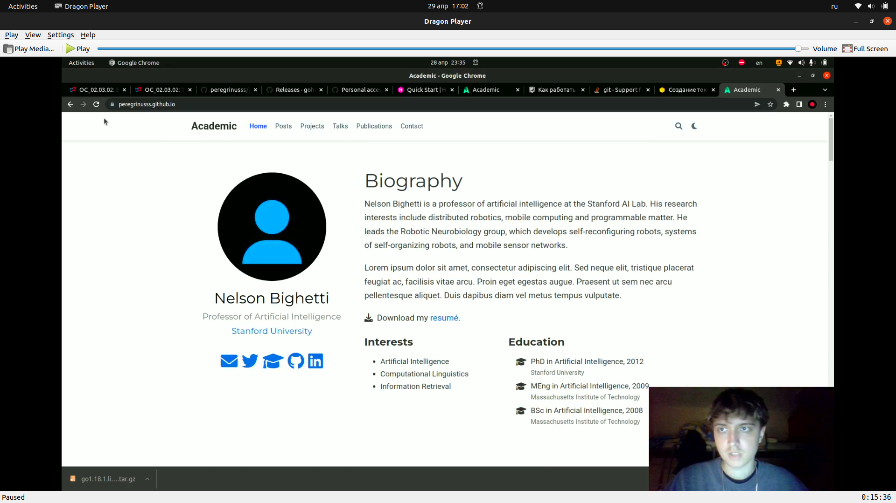

**Первый этап проекта**

**Размещение на Github pages заготовки для персонального сайта.**

Перевощиков Данил Алексеевич

---

## Цель работы:

Разместить заготовку сайта на Github pages.

---

## Основные этапы выполнения работы

**1.** Клонировали щаблон сайта на гитхаб и в локальную папку.

**2.** Запустили hugo server в локальной папке и удалили welcome page.

**3.** Создали репозиторий с названием адреса будущего сайта и локально клонировали его рядом с шаблоном.

**4.** Добавили ветку main будущему сайту и запушили на гитхаб.

**5.** Добавили submodule в папку public в папку с шаблоном. После чего в папке public появились основные файлы нашего сайта.

**6.** Запушили все новые файлы на гитхаб, подождали пока страница загрузится и перешли по адресу сайта.

---

## Основные этапы выполнения работы

Так выглядит наш готовый сайт:

{ #fig:001 width=70% }

---

## Результат

Мы разместили заготовку сайта на Github pages.