---
## Front matter
title: "Индивидуальный проект 1 этап"
subtitle: "Размещение на Github pages заготовки для персонального сайта."
author: "Перевощиков Данил Алексеевич"

## Generic otions
lang: ru-RU
toc-title: "Содержание"

## Bibliography
bibliography: bib/cite.bib
csl: pandoc/csl/gost-r-7-0-5-2008-numeric.csl

## Pdf output format
toc: true # Table of contents
toc-depth: 2
lof: true # List of figures
lot: true # List of tables
fontsize: 12pt
linestretch: 1.5
papersize: a4
documentclass: scrreprt
## I18n polyglossia
polyglossia-lang:
  name: russian
  options:
	- spelling=modern
	- babelshorthands=true
polyglossia-otherlangs:
  name: english
## I18n babel
babel-lang: russian
babel-otherlangs: english
## Fonts
mainfont: PT Serif
romanfont: PT Serif
sansfont: PT Sans
monofont: PT Mono
mainfontoptions: Ligatures=TeX
romanfontoptions: Ligatures=TeX
sansfontoptions: Ligatures=TeX,Scale=MatchLowercase
monofontoptions: Scale=MatchLowercase,Scale=0.9
## Biblatex
biblatex: true
biblio-style: "gost-numeric"
biblatexoptions:
  - parentracker=true
  - backend=biber
  - hyperref=auto
  - language=auto
  - autolang=other*
  - citestyle=gost-numeric
## Pandoc-crossref LaTeX customization
figureTitle: "Рис."
tableTitle: "Таблица"
listingTitle: "Листинг"
lofTitle: "Список иллюстраций"
lotTitle: "Список таблиц"
lolTitle: "Листинги"
## Misc options
indent: true
header-includes:
  - \usepackage{indentfirst}
  - \usepackage{float} # keep figures where there are in the text
  - \floatplacement{figure}{H} # keep figures where there are in the text
---

# Цель работы

Разместить заготовку сайта на Github pages.

# Ход работы

**1.**
Копируем шаблон сайта на репозиторий GitHub и клонируем его в локальную папку под названием CV(рис. [-@fig:001;-@fig:002;-@fig:003])

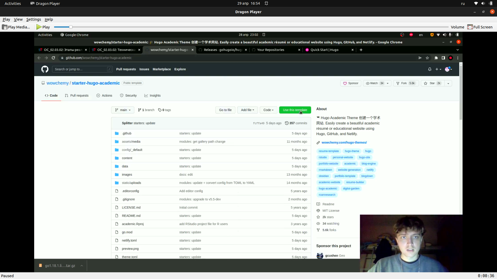{ #fig:001 width=70% }

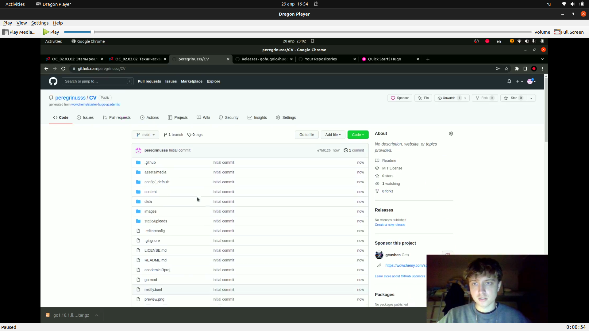{ #fig:002 width=70% }

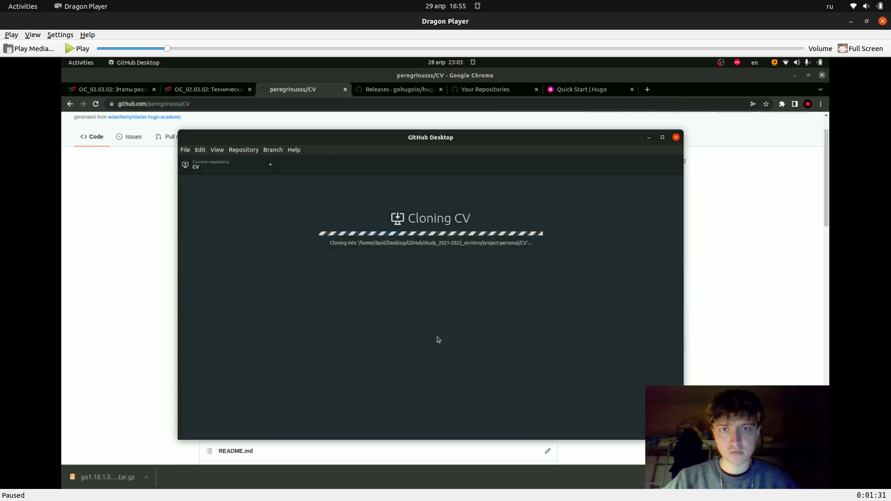{ #fig:003 width=70% }

**2.**
Запускаем hugo и hugo server в созданной папке и переходим по ссылке. (рис. [-@fig:004;-@fig:005;-@fig:006])

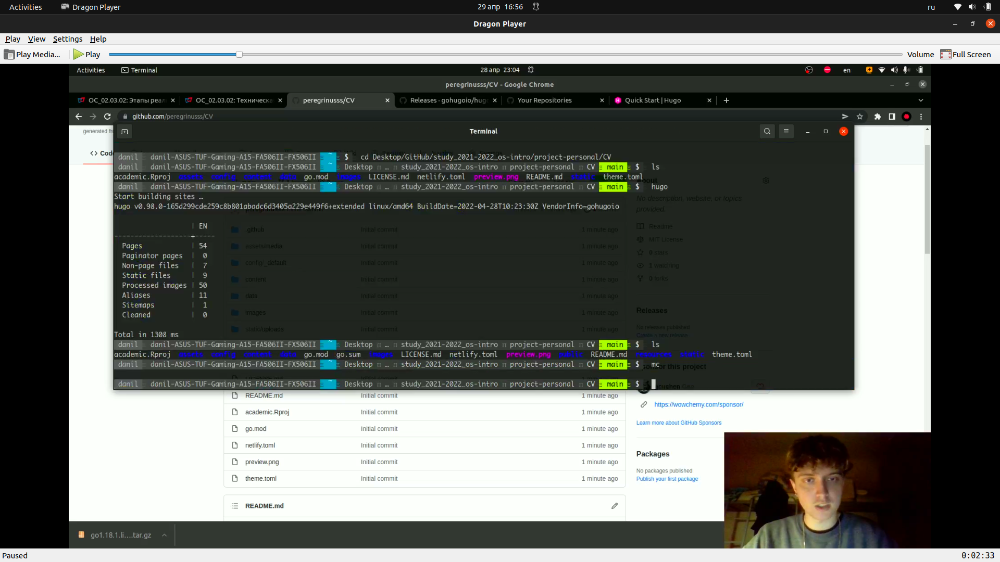{ #fig:004 width=70% }

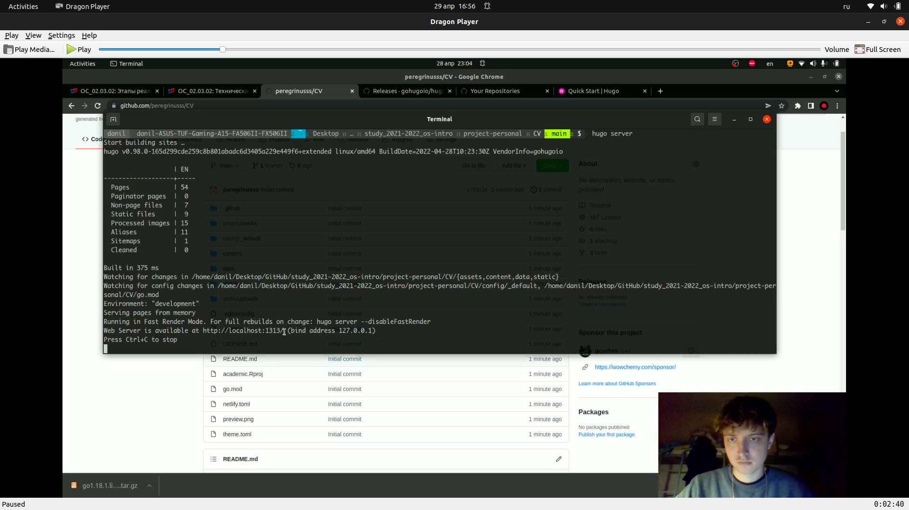{ #fig:005 width=70% }

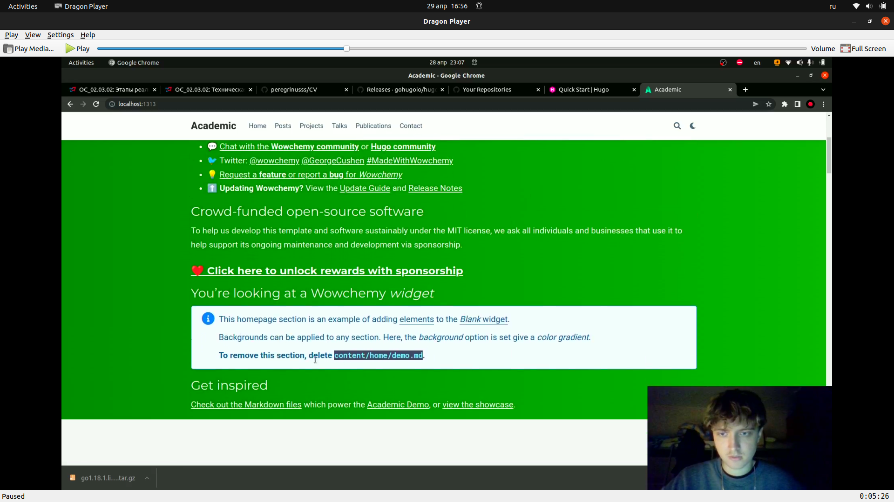{ #fig:006 width=70% }

Далее нам необходимо удалить welcome page, это было написано на самой страницы, для этого удалиляем файл content/home/demo.md.(рис. [-@fig:007;-@fig:008])

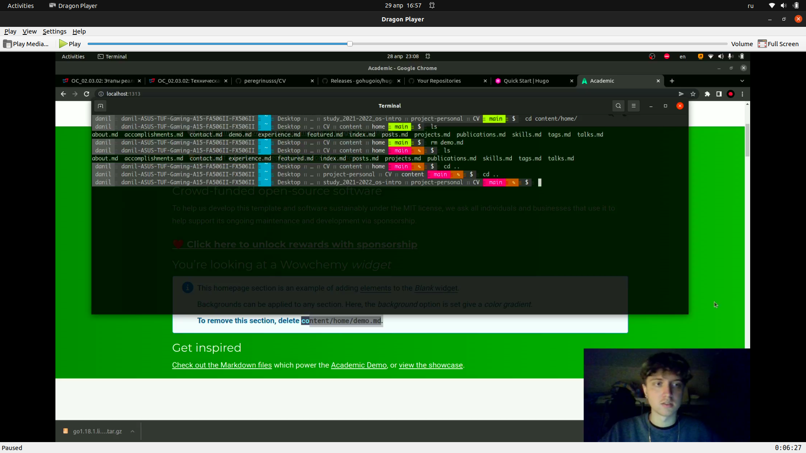{ #fig:007 width=70% }

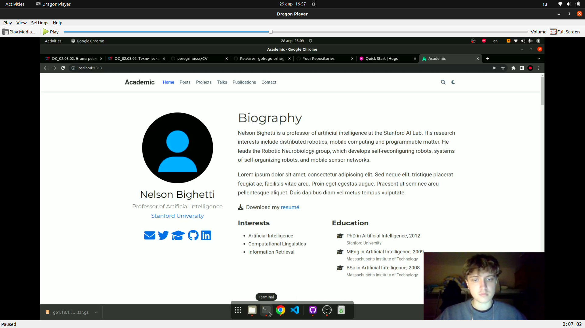{ #fig:008 width=70% }

**3.**
Создаем репозиторий на github с названием адреса будещего сайта и клонируем его в локальную папку рядом с CV.(рис. [-@fig:009;-@fig:010])

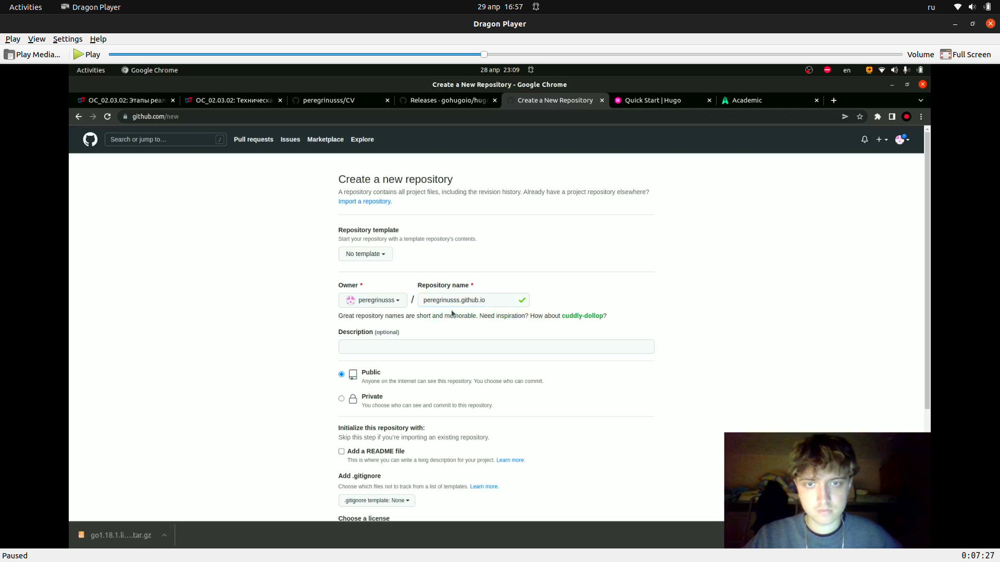{ #fig:009 width=70% }

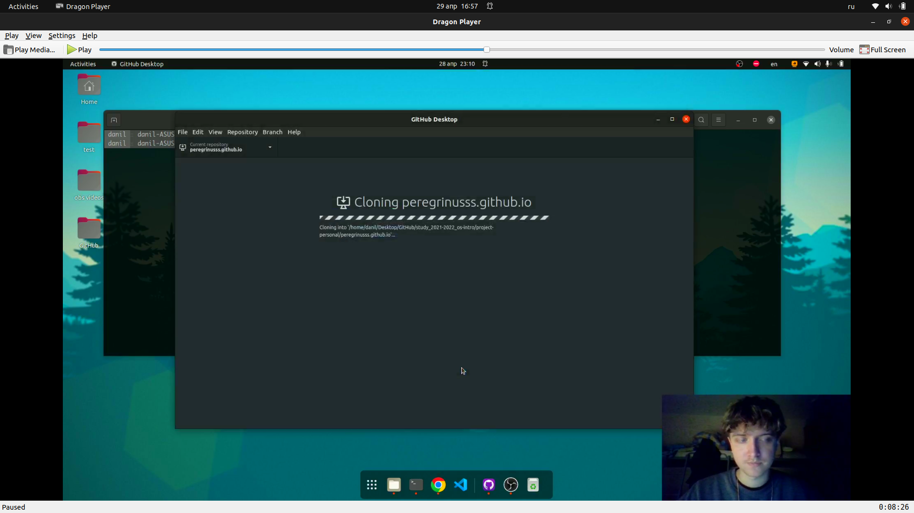{ #fig:010 width=70% }

**4.**
Добавляем ветку в локальную папку с будущим сайтом и пушим её на github.(рис. [-@fig:011])

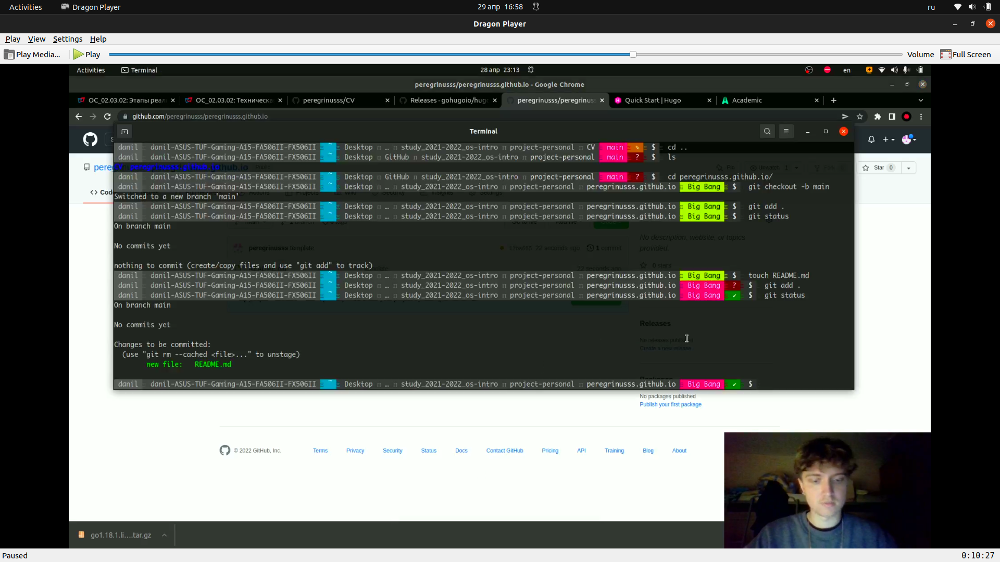{ #fig:011 width=70% }

Переходим в CV и добавляем туда submodule в папку public, но перед этим убираем public из .gitignore.(рис. [-@fig:012;-@fig:013])

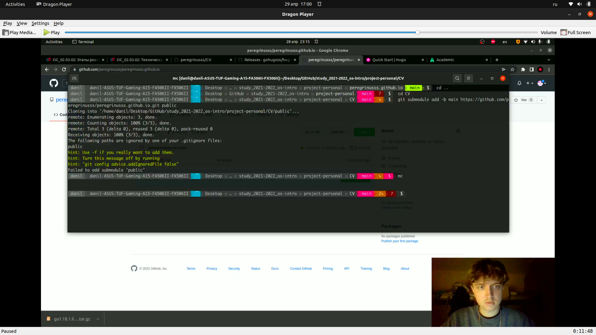{ #fig:012 width=70% }

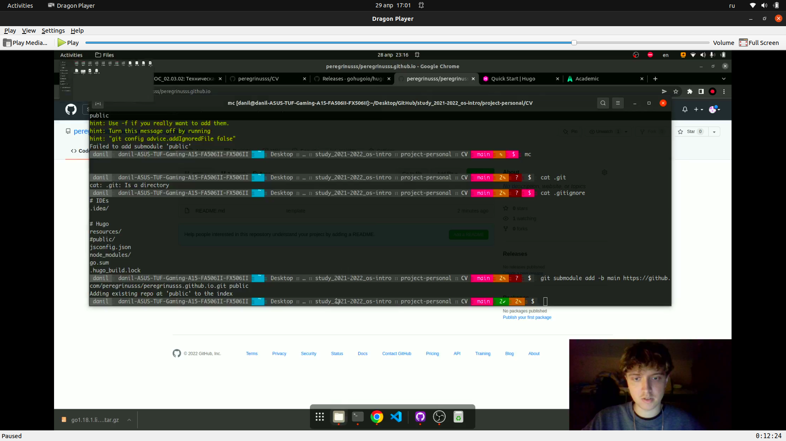{ #fig:013 width=70% }

После этого в папке CV/public появятся файлы будущего сайта.(рис. [-@fig:014])

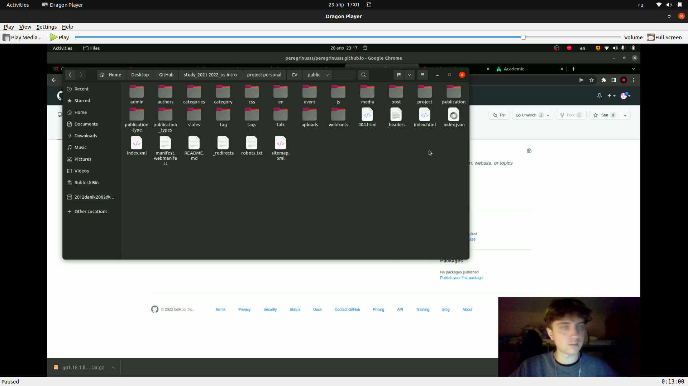{ #fig:014 width=70% }

**5.**
Отправка всех новых файлов на github.(рис. [-@fig:015])

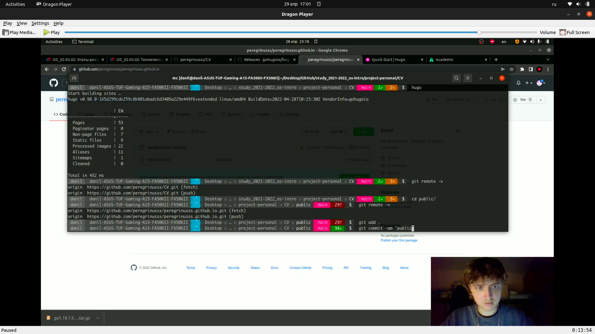{ #fig:015 width=70% }

После этого папка public на гитхаб будет выглядеть так.(рис. [-@fig:016])

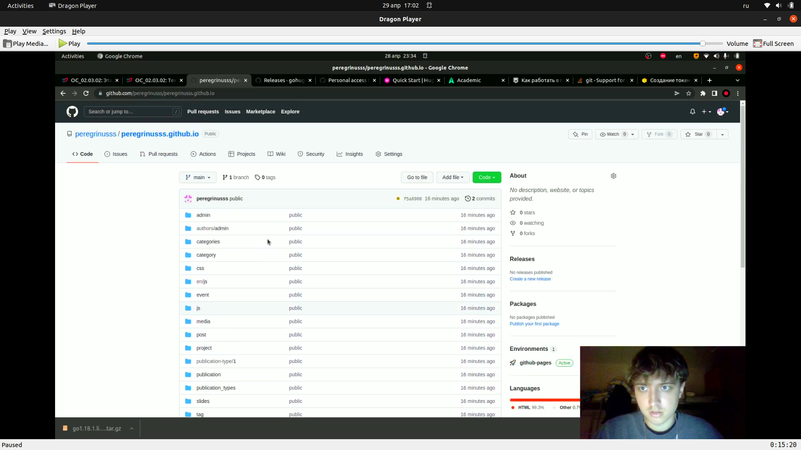{ #fig:016 width=70% }

После этого переходим по ссылке на наш сайт и наслаждаемся.(рис. [-@fig:017])

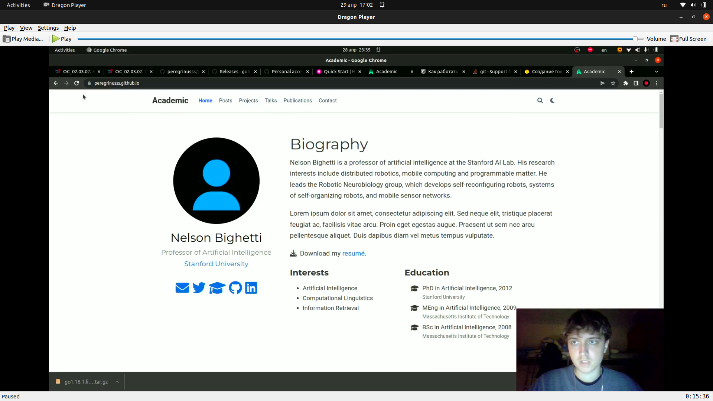{ #fig:017 width=70% }

# Результат

Мы разместили заготовку сайта на Github pages.