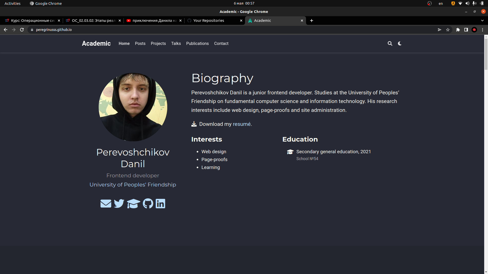
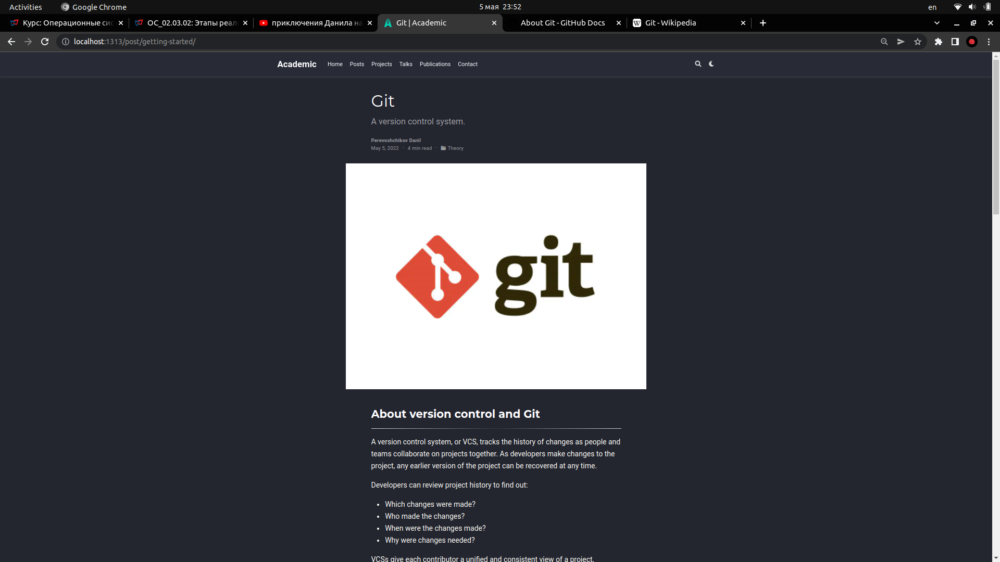

**Индивидуальный проект 2 этап**

**Добавление к сайту данных о себе**

Перевощиков Данил Алексеевич

---

## Цель работы:

- Разместить фотографию владельца сайта.
- Разместить краткое описание владельца сайта (Biography).
- Добавить информацию об интересах (Interests).
- Добавить информацию от образовании (Education).
- Добавить пост на тему "Управление версиями. Git."

---

## Основные этапы выполнения работы

**1.** Запустили локальный сервер hugo в каталоге CV.

**2** Перенесли свой аватар в папку со страницей биографии, переименовали его и удалили старую картинку.

**3** Изменили имя и фамилию, краткую биографию, информацию о образваонии и интересах.

---

## Основные этапы выполнения работы

В итоге наша биография стала выглядеть так (рис. [-@fig:001]):

{ #fig:001 width=70% }

---

## Основные этапы выполнения работы

**4** Перенесли логотип Git в папку с постами, переименовали его и удалили старую картинку.

**5** Изменили название поста, краткую информацию, дату публикации, теги и категории.

**6** Заполнили контент поста.

---

## Основные этапы выполнения работы

В итоге наш пост стал выглядеть так (рис. [-@fig:002;-@fig:003]):

{ #fig:002 width=70% }

---

{ #fig:003 width=80% }