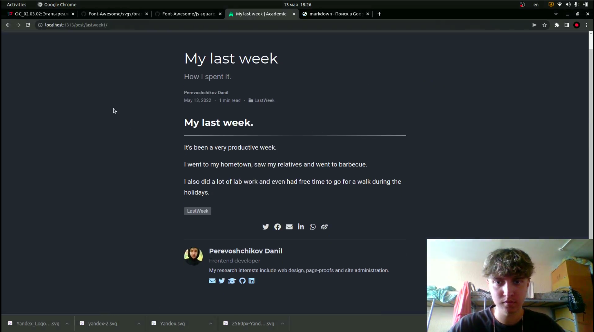

# Добававление к сайту достижений

---

## Цель работы:

- Добавить информацию о навыках (Skills).
- Добавить информацию об опыте (Experience).
- Добавить информацию о достижениях (Accomplishments).
- Сделать пост по прошедшей неделе.
- Добавить пост на тему "Язык разметки Markdown".

---

## Основные этапы выполнения работы

**1.** Добавили информацию о навыках (Skills).(рис. [-@fig:001])

{ #fig:001 width=70% }

---

## Основные этапы выполнения работы

**2.** Добавили информацию об опыте (Experience).(рис. [-@fig:002])

{ #fig:002 width=70% }

---

## Основные этапы выполнения работы

**3.** Добавили информацию о достижениях (Accomplishments).(рис. [-@fig:003])

{ #fig:003 width=70% }

---

## Основные этапы выполнения работы

**4.** Сделали пост по прошедшей неделе.(рис. [-@fig:004])

{ #fig:004 width=70% }

---

## Основные этапы выполнения работы

**5.** Добавили пост на тему "Язык разметки Markdown".(рис. [-@fig:005])

{ #fig:005 width=70% }