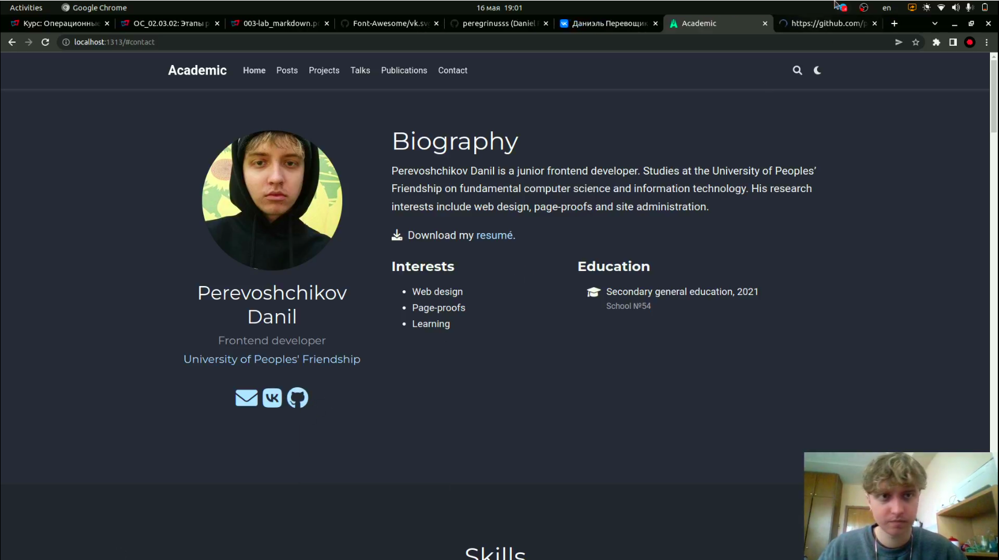
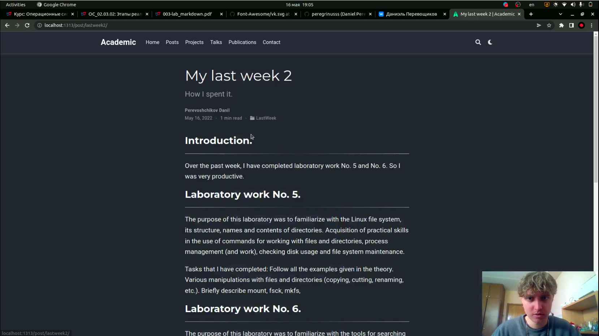
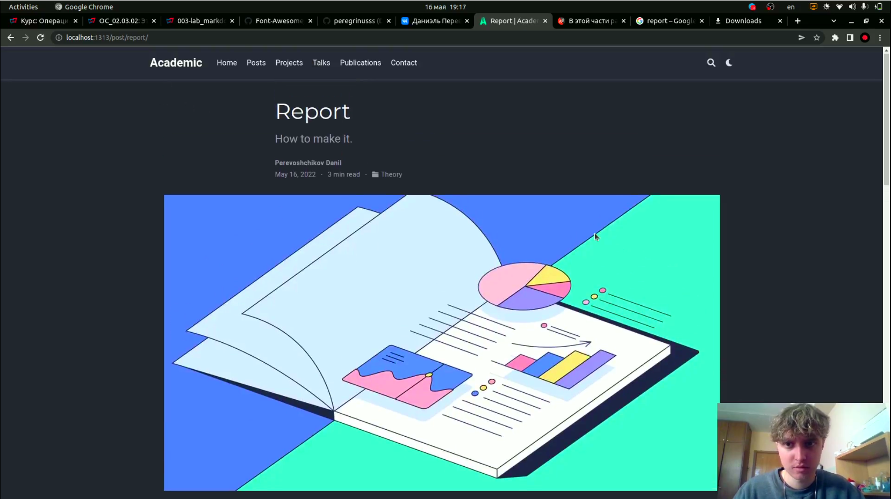

# Добавление к сайту ссылок на научные и библиометрические ресурсы

---

## Цель работы:

Зарегистрироваться на соответствующих ресурсах и разместить на них ссылки на сайте:

- vk : https://vk.com/.
- github : https://github.com/.

Сделать пост по прошедшей неделе.

Добавить пост на тему "Оформление отчёта".

---

## Основные этапы выполнения работы

**1.** Добавили ссылки на вк и гитхаб, также оставили ссылку на contact.(рис. [-@fig:001])

{ #fig:001 width=70% }

---

## Основные этапы выполнения работы

**2.** Сделали пост по прошедшей неделе.(рис. [-@fig:002])

{ #fig:002 width=70% }

---

## Основные этапы выполнения работы

**3.** Добавили пост на тему "Оформление отчёта".(рис. [-@fig:003])

{ #fig:003 width=70% }