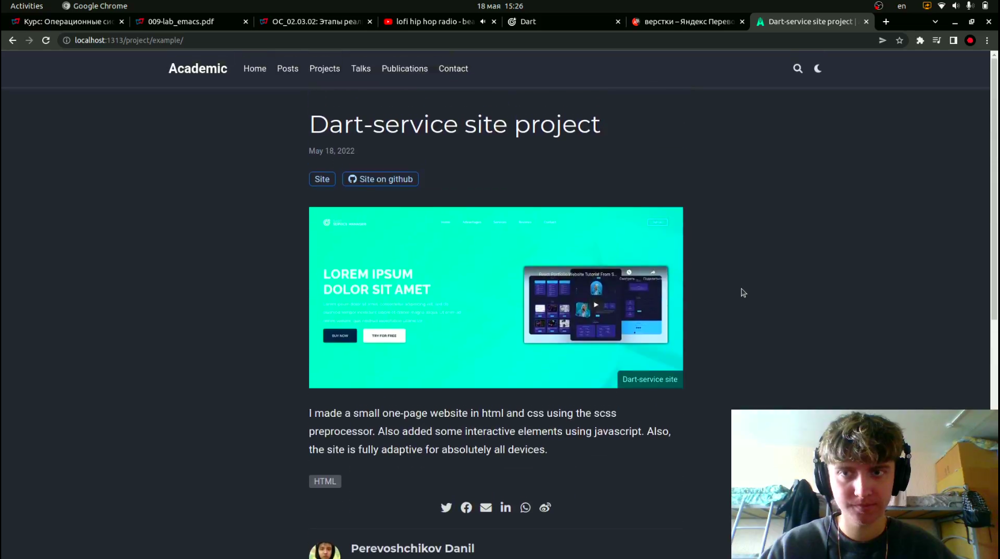
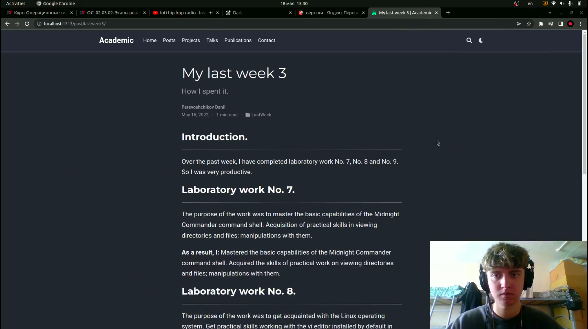
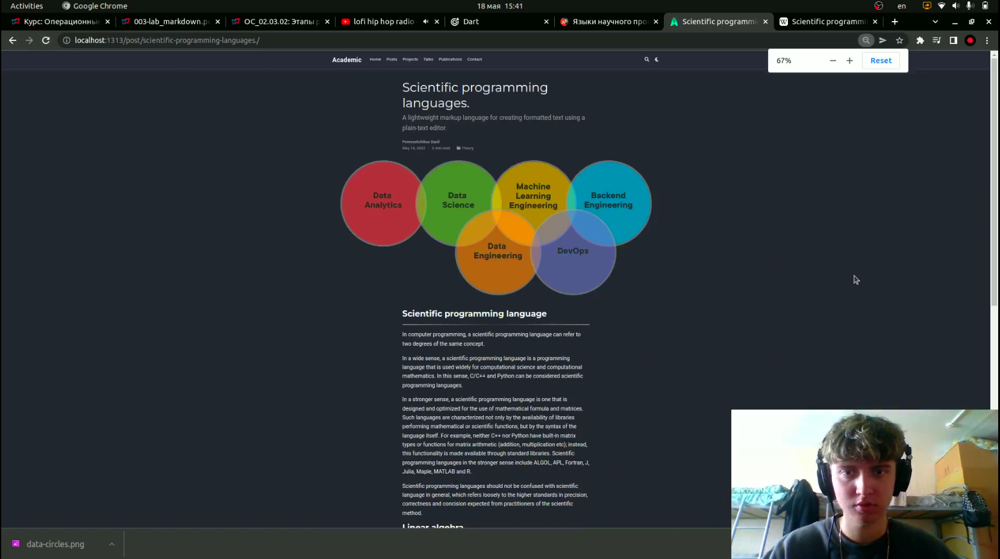

# Добавление к сайту всех остальных элементов

---

## Цель работы:

- Сделать записи для персональных проектов.
- Сделать пост по прошедшей неделе.
- Добавить пост на тему "Языки научного программирования".

---

## Основные этапы выполнения работы

**1.** Добавили проект на сайт: указали ссылки на проект на хостинге гитхаб и на сам репозиторий с проектом, добавили картинку preview и небольшое описание.(рис. [-@fig:001])

{ #fig:001 width=80% }

---

## Основные этапы выполнения работы

**2.** Сделали пост по прошедшей неделе.(рис. [-@fig:002])

{ #fig:002 width=80% }

---

## Основные этапы выполнения работы

**3.** Добавили пост на тему "Языки научного программирования".(рис. [-@fig:003])

{ #fig:003 width=80% }