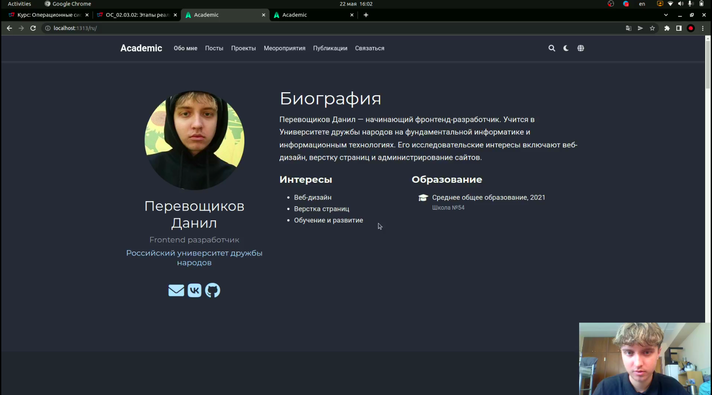
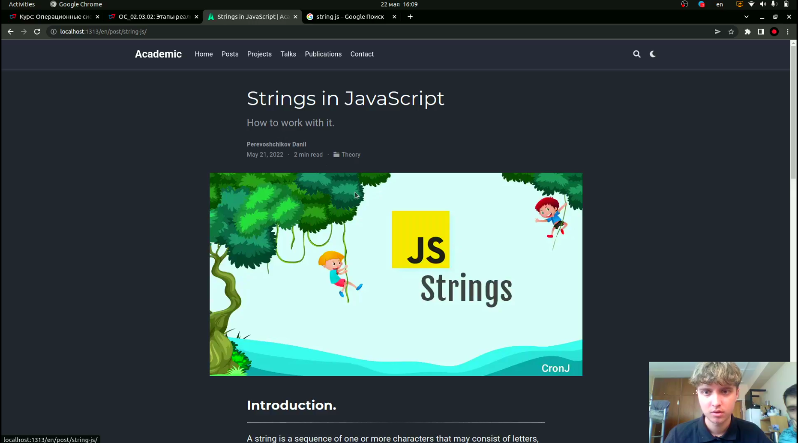
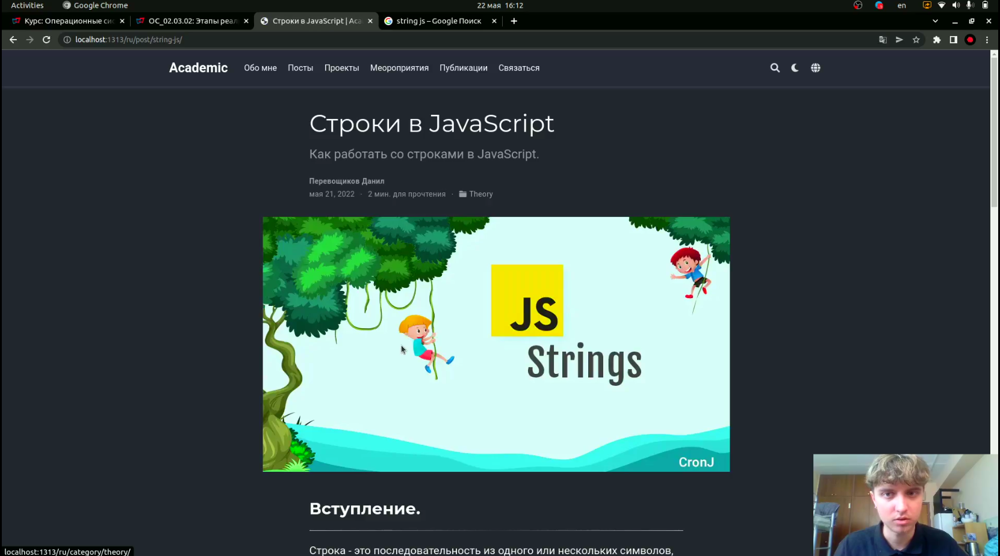
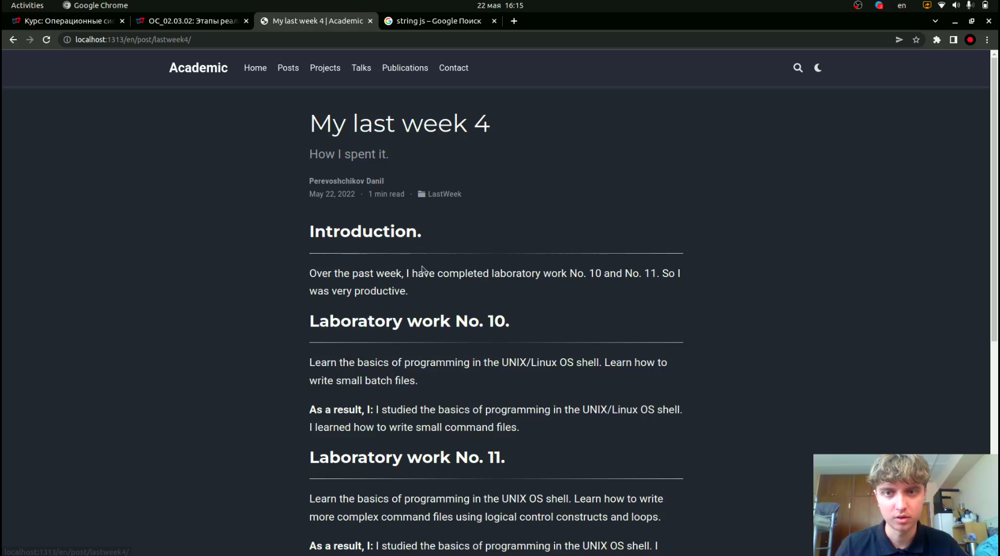
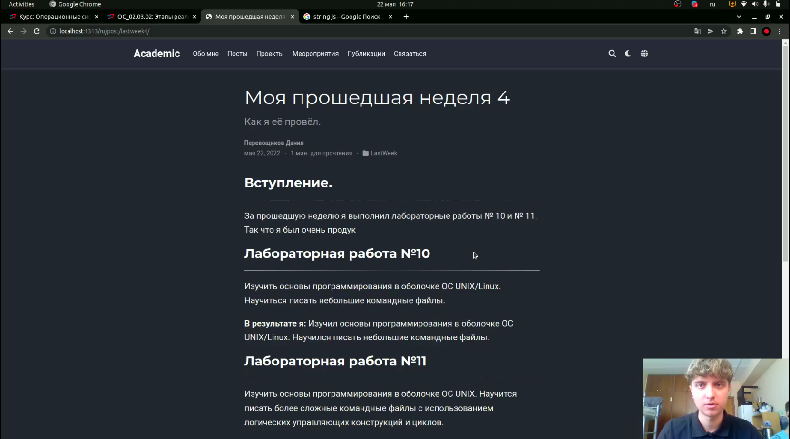

# Размещение двуязычного сайта на Github.

---

## Цель работы:

- Сделать поддержку английского и русского языков.
- Разместить элементы сайта на обоих языках.
- Разместить контент на обоих языках.
- Сделать пост по прошедшей неделе.
- Добавить пост на тему по выбору (на двух языках).

---

## Основные этапы выполнения работы

**1.** Изменили файл languages.yaml, добавили ссылки на папки ru и en, перевели шапку сайта.

**2.** Создали папки en и ru в директории content, заранее переведя всё содержимое файлов (посты, биографию, проекты и т.д.).

**3.** Изменили параметр defaultContentLanguageInSubdir на true в файле config.yaml.

---

## Основные этапы выполнения работы

В итоге у нас появилась русская версия сайта.(рис. [-@fig:004])

{ #fig:004 width=80% }

---

## Основные этапы выполнения работы

**4.** Добавили пост на тему "Строки в JavaScript" на двух языках.(рис. [-@fig:005;-@fig:006])

{ #fig:005 width=80% }

---

## Основные этапы выполнения работы

{ #fig:006 width=80% }

---

## Основные этапы выполнения работы

**5.** Сделали пост по прошедшей неделе на двух языках.(рис. [-@fig:007;-@fig:008])

{ #fig:007 width=80% }

---

## Основные этапы выполнения работы

{ #fig:008 width=80% }